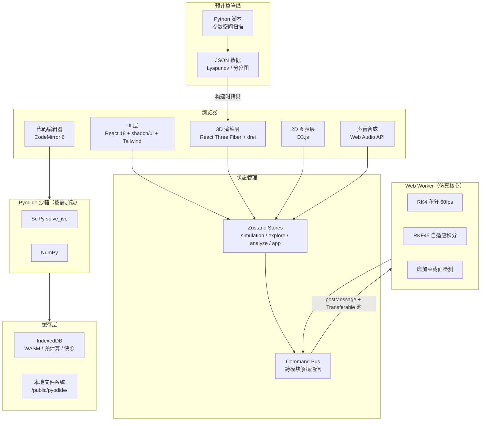

# 双摆非线性动力学虚拟仿真实验

> 浏览器内的非线性动力学研究终端 —— 感知、分析、验证、创造的物理认知平台。

[](https://react.dev/)
[](https://www.typescriptlang.org/)
[](https://vitejs.dev/)
[](https://threejs.org/)
[](https://zustand.docs.pmnd.rs/)
[](.github/workflows/ci.yml)

## 项目简介

双摆非线性动力学虚拟仿真实验是一个**纯客户端**非线性动力学交互平台，在浏览器中实时仿真双摆系统，通过四层递进模式帮助用户从感知到创造深入理解混沌现象。

- **感知层**：3D 实时仿真 + 运动尾迹 + 声音化引擎，让混沌"可见可听"
- **分析层**：Lyapunov 指数谱 + 分岔图 + 庞加莱截面，从数据维度解析混沌
- **验证层**：时间反演实验 + 蝴蝶效应对比器 + 物理验证套件，验证非线性系统的核心性质
- **创造层**：Python 可编程沙箱 + 实验报告生成，让用户自己定义运动方程

**核心约束**：零后端依赖，产出物为自包含 HTML5 文件夹，支持 file:// 协议离线运行。

## 功能特性

> 功能模块按照 [设计意图原始材料](docs/功能设计/原始材料/) 划分，共 8 大功能模块 + 系统基础能力。

### 核心功能模块

| 模块 | 子功能 | 阶段 | 状态 |
|------|--------|:--:|:--:|
| **仿真引擎与3D场景** | RKF45 积分引擎 + Web Worker 常驻 + Float64Array Transferable 池<br>3 视角 + 3 材质 + 2 环境 + 响应式降级<br>速度→颜色尾迹映射 + 粗细随速度 + 5 种持久度<br>能量实时监控（E_k+E_p 曲线 + 漂移百分比）<br>相空间可视化（θ-θ̇ Canvas 实时轨迹） | P0 | ✅ 已落地 |
| **参数面板与模式导航** | ≥10 参数滑块+数值输入双模式 + 预设管理<br>连续参数即时生效 / 初始条件参数释放生效<br>四模式一键切换 + 键盘快捷键 + 跨模式状态保持<br>桌面三栏 / 平板底部抽屉 / 手机单栏聚焦 | P0 | ✅ 已落地 |
| **混沌现象探索** | Web Audio API 声音化引擎（音高/和声/音色/混沌噪声）<br>蝴蝶效应双 Viewport 并排 + δ=10⁻⁶° + 分离度脉冲提示<br>时间反演实验（精确反演 + 数值反演 + 漂移曲线 + 教学注释） | P1 | ✅ 已落地 |
| **动力学分析工具** | Lyapunov 指数谱预计算热力图 + 图层切换 + 点击填充参数<br>参数空间分岔图 + 竖直游标联动 + 框选放大<br>庞加莱截面 Worker 穿越检测 + 动态生长散点图<br>预计算数据管线（Python 离线生成 + IndexedDB 缓存 + SHA-256 校验）<br>能量景观地形图（3D 势能曲面 + 实时光点） | P1 | 🚧 进行中 |
| **演示与数据管理** | 故事脚本引擎（7 阶段 3 分 30 秒自动演示 + 电影式字幕）<br>状态快照 + 双快照对比 + 参数差异表<br>数据导出（CSV / JSON / PNG 三种格式）<br>历史回放 + 轨迹分叉（修改历史参数→分叉 Worker）<br>演示模式（纯净视图 + 自动巡游 + 水印） | P1/P3 | 🚧 进行中 |
| **受力拆解视图** | 力矢量叠加（重力/拉力/惯性力） + 坐标系切换（笛卡尔/极坐标/自然坐标）<br>悬浮数值提示 + 历史极值标记 | P2 | ✅ 已落地 |
| **物理验证套件** | 三标准项一键验证（小角度线性化 / 单摆退化 / 能量守恒）<br>四项状态机 + 绿色徽章 + 不通过诊断建议 | P2 | ✅ 已落地 |
| **用户可编程沙箱** | CodeMirror 6 Python 编辑器 + 3 预设模板<br>Pyodide 安全沙箱（白名单 import + 5s 超时 + 无文件系统/网络）<br>即时模型切换（执行成功→注入 3D 场景） | P3 | 🚧 进行中 |

### 系统基础能力

| 模块 | 功能 | 状态 |
|------|------|:--:|
| 应用可观测性 | FPS 追踪 + Worker 耗时 + 全局错误捕获 + Debug 面板 | ✅ 已落地 |
| 持续部署管线 | GitHub Actions 三阶段：代码检查 → 测试 → 构建 | ✅ 已落地 |
| 运行时异常处理 | 超时行号高亮 + 后台自动暂停 + 长时间降级 + 错误中文翻译 | ✅ 已落地 |
| 应用初始化加载 | Pyodide 下载进度条 + 预计剩余时间 + IndexedDB 缓存 + 离线重试 | ✅ 已落地 |
| 自动化测试体系 | 物理回归测试 + 预计算数据校验 + UI 组件测试 | 🚧 进行中 |

## 技术栈

### 前端

| 类别 | 技术 | 版本 |
|------|------|------|
| 框架 | React | 18.3 |
| 类型系统 | TypeScript | 5.6 |
| 构建工具 | Vite | 5.4 |
| 状态管理 | Zustand | 4.5 |
| UI 样式 | Tailwind CSS | 3.4 |
| UI 组件 | shadcn/ui (Radix) | latest |
| 3D 渲染 | React Three Fiber + drei | 8.17 / 9.114 |
| 2D 图表 | D3.js（按需模块） | 7.x |
| 音频合成 | Web Audio API | 原生 |
| 代码编辑器 | CodeMirror 6 + lang-python | 6.x |
| PDF 生成 | jsPDF + autoTable | 2.5 |

### 计算引擎

| 类别 | 技术 | 说明 |
|------|------|------|
| ODE 实时求解 | 自实现 RK4 + RKF45 | Web Worker 常驻，Transferable 零拷贝 |
| Python 沙箱 | Pyodide v0.26.1 + SciPy | 按需懒加载，三级缓存（本地→IndexedDB→CDN） |
| 预计算 | Python 脚本 + NumPy + SciPy | 离线参数空间扫描 → JSON → 静态资源 |

### 测试与 CI

| 类别 | 技术 |
|------|------|
| 测试框架 | Vitest + @testing-library/react |
| CI/CD | GitHub Actions（check → test → build） |
| 包管理器 | pnpm 10 |

## 项目结构

```text
chaos-pendulum/
├── src/
│   ├── features/                  # 业务功能（Feature-Based）
│   │   ├── simulation/            # 仿真引擎（Worker + ODE + Store + 能量/相空间）
│   │   ├── explore/               # 混沌现象探索（3D 场景 + 尾迹 + 蝴蝶效应 + 声音化 + 时间反演）
│   │   ├── analyze/               # 动力学分析（热力图 + 分岔图 + 庞加莱 + 预计算）
│   │   ├── lab/                   # 教学实验（受力拆解 + 物理验证 + 可编程沙箱）
│   │   ├── story/                 # 故事模式（自动演示 + 字幕）
│   │   ├── data/                  # 数据管理（快照 + 导出 + 回放 + 分叉）
│   │   └── system/                # 系统能力（初始化 + 异常处理）
│   ├── shared/                    # 跨 Feature 共享（零业务逻辑）
│   │   ├── components/            # shadcn/ui + 布局壳
│   │   ├── hooks/                 # 通用 Hooks（尺寸/设备/可见性）
│   │   ├── lib/                   # 工具（缓存/可观测性/工具函数）
│   │   ├── audio/                 # Web Audio 声音化引擎
│   │   ├── types/                 # 全局类型定义
│   │   └── data/                  # 预计算 JSON 数据
│   └── stores/                    # 全局 Store + Command Bus
├── scripts/precompute/            # Python 离线预计算脚本
├── public/pyodide/                # Pyodide 离线 WASM 包
├── docs/                          # 设计文档与审查报告
│   └── 功能设计/原始材料/          # 8 份设计意图原始记录（权威设计源）
└── .github/workflows/             # CI/CD 流水线
```

## 架构图



## 快速开始

### 环境要求

- **Node.js** ≥ 22
- **pnpm** ≥ 10
- **Python** ≥ 3.11（仅预计算脚本需要，可选）

### 安装与运行

```bash
# 1. 安装依赖
pnpm install

# 2. 启动开发服务器
pnpm dev

# 3. 构建生产包
pnpm build

# 4. 预览生产包
pnpm preview
```

### 预计算数据（可选）

```bash
# 生成 Lyapunov 指数谱与分岔图预计算数据
pnpm precompute
```

### 运行测试

```bash
# 运行全部测试
pnpm test

# 监听模式
pnpm test:watch
```

## 架构设计要点

- **Feature-Based 组织**：每个功能模块自包含（contracts + domain + application + infrastructure + viewModel + view），通过 `index.ts` 暴露公共接口，内部实现对外不可见
- **Worker 隔离**：ODE 积分在 Web Worker 中执行，通过 Transferable Float64Array 零拷贝传输，不阻塞主线程
- **Command Bus 解耦**：跨模块通信通过 Command Bus 而非直接引用，Scene3D、TimeReversal 等组件通过统一接口消费仿真数据
- **契约驱动开发**：所有模块以契约文件（`.contract.ts`）为宪法，定义接口边界、状态转换、异常规范与禁止行为
- **全局 Store 最小化**：仅 `useAppStore` 管理跨模式全局状态（模式/设备/加载），业务状态下沉至各 Feature 内部
- **预计算管线分离**：Python 脚本独立于前端构建流程，输出 JSON 作为静态资源引入，运行时 IndexedDB 缓存

## 演进路线

| 阶段 | 包含模块 | 状态 |
|------|---------|:--:|
| P0 核心骨架 | 仿真引擎与3D场景 + 参数面板与模式导航 | ✅ 已完成 |
| P1 核心差异点 | 混沌现象探索 + 动力学分析工具 + 演示与数据管理（演示部分） | 🚧 进行中 |
| P2 增强体验 | 受力拆解视图 + 物理验证套件 + 动力学分析工具（能量景观）+ 演示与数据管理（演示模式） | 🚧 部分落地 |
| P3 扩展能力 | 用户可编程沙箱 + 演示与数据管理（数据管理部分） | 🚧 部分落地 |
| 系统基础能力 | 可观测性 + CI/CD + 异常处理 + 初始化加载 + 自动化测试 | ✅ 基本完成 |

## 设计文档

项目设计文档位于 `docs/` 目录。**设计意图原始材料**（`docs/功能设计/原始材料/`）为当前权威设计源，`_archived/` 目录下的旧版模块拆分文档已废弃。

- [技术栈设计](docs/双摆混沌实验室-技术栈设计.md) — 全栈技术选型与架构设计（含 5 项 ADR）
- [项目结构设计](docs/双摆混沌实验室-项目结构.md) — Feature-Based 目录结构与模块边界
- [设计意图原始材料](docs/功能设计/原始材料/) — 8 份权威功能设计文档：
  - [仿真引擎与3D场景](docs/功能设计/原始材料/仿真引擎与3D场景-原始设计意图_v0.md)
  - [参数面板与模式导航](docs/功能设计/原始材料/参数面板与模式导航-原始设计意图_v0.md)
  - [混沌现象探索](docs/功能设计/原始材料/混沌现象探索-原始设计意图_v0.md)
  - [动力学分析工具](docs/功能设计/原始材料/动力学分析工具-原始设计意图_v0.md)
  - [演示与数据管理](docs/功能设计/原始材料/演示与数据管理-原始设计意图_v0.md)
  - [受力拆解视图](docs/功能设计/原始材料/受力拆解视图-原始设计意图_v0.md)
  - [物理验证套件](docs/功能设计/原始材料/物理验证套件-原始设计意图_v0.md)
  - [用户可编程沙箱](docs/功能设计/原始材料/用户可编程沙箱-原始设计意图_v0.md)
- [前端页面骨架设计](docs/前端页面骨架设计.md) — 四大模式页面布局与交互骨架
- [审查报告](docs/审查报告/) — 模块实现度与联动审查报告

## License

MIT
