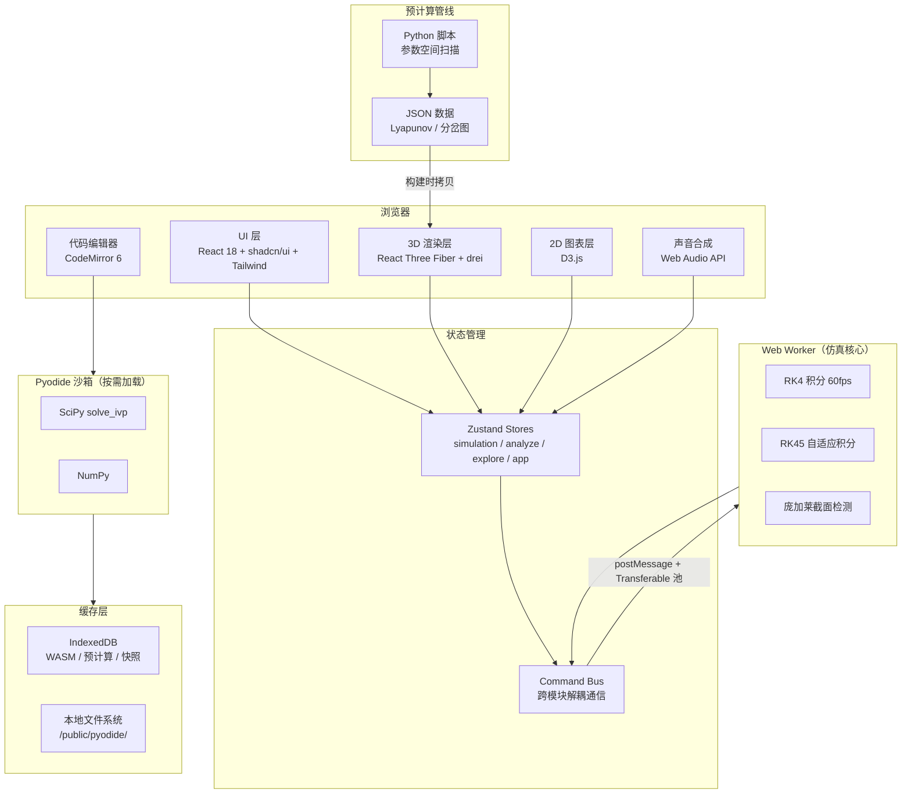

# 双摆混沌实验室 (Chaos Pendulum Lab)

> 浏览器内的非线性动力学研究终端 —— 感知、分析、验证、创造的物理认知平台。

[](https://react.dev/)
[](https://www.typescriptlang.org/)
[](https://vitejs.dev/)
[](https://threejs.org/)
[](https://zustand.docs.pmnd.rs/)
[](.github/workflows/ci.yml)

## 项目简介

双摆混沌实验室是一个**纯客户端**非线性动力学交互平台，在浏览器中实时仿真双摆系统，通过四层递进模式帮助用户从感知到创造深入理解混沌现象。

- **感知层**：3D 实时仿真 + 运动尾迹 + 声音化引擎，让混沌"可见可听"
- **分析层**：Lyapunov 指数谱 + 分岔图 + 庞加莱截面，从数据维度解析混沌
- **验证层**：时间反演实验 + 蝴蝶效应对比器 + 物理验证套件，验证非线性系统的核心性质
- **创造层**：Python 可编程沙箱 + 实验报告生成，让用户自己定义运动方程

**核心约束**：零后端依赖，产出物为自包含 HTML5 文件夹，支持 file:// 协议离线运行。

## 功能特性

### 仿真核心与全局控制（SIM）

| 模块 | 功能 | 状态 |
|------|------|:--:|
| SIM-01 双摆物理引擎 | RK4/RK45 积分 + Web Worker + Transferable Float64Array 池 + 批量积分 | ✅ 已落地 |
| SIM-02 参数控制面板 | ≥10 参数滑块+数值输入双模式 + 合法性校验 + 预设管理 | ✅ 已落地 |
| SIM-03 全局导航系统 | 4 模式一键切换 + 响应式导航栏 + 键盘快捷键 + Error Boundary | ✅ 已落地 |
| SIM-04 能量实时监控 | E_k + E_p 实时曲线 + 漂移百分比 + 1000s 漂移 <0.5% 告警 | ✅ 已落地 |
| SIM-05 相空间可视化 | θ-θ̇ 2D 相平面 Canvas 实时轨迹 + 变量对切换 + 历史叠加 | ✅ 已落地 |

### 探索模式（EXP）

| 模块 | 功能 | 状态 |
|------|------|:--:|
| EXP-01 3D 仿真场景 | R3F + drei — 3 视角 + 3 材质 + 2 环境 + 响应式降级 | 🚧 进行中 |
| EXP-02 运动尾迹渲染 | 速度→颜色映射 + 粗细随速度 + 5 种持久度 | 🚧 进行中 |
| EXP-03 声音化引擎 | Web Audio API — 音高/和声/音色/混沌噪声四维映射 | 🚧 进行中 |
| EXP-04 蝴蝶效应对比器 | 双 Viewport 并排 + δ=10⁻⁶° + 分离度脉冲提示 | 🚧 进行中 |
| EXP-05 时间反演实验 | 精确反演 + 数值反演双模式 + 漂移距离曲线 + 教学注释 | 📋 规划中 |

### 分析模式（ANL）

| 模块 | 功能 | 状态 |
|------|------|:--:|
| ANL-01 李雅普诺夫指数谱 | 预计算 100×100 热力图 + 图层切换 + 点击填充参数 | 🚧 进行中 |
| ANL-02 参数空间分岔图 | 单参数扫描散点图 + 竖直游标联动 + 框选放大 | 🚧 进行中 |
| ANL-03 庞加莱截面 | Worker 穿越检测 + 动态生长散点图 + 当前/历史轨线叠加 | ✅ 已落地 |
| ANL-04 能量景观地形图 | 3D 半透明势能曲面 + 实时光点 + 等高线投影 | 📋 规划中 (P2) |

### 实验模式（LAB）

| 模块 | 功能 | 状态 |
|------|------|:--:|
| LAB-01 受力拆解视图 | 力矢量叠加 + 坐标系切换 + 历史极值标记 | 📋 规划中 (P2) |
| LAB-02 物理验证套件 | 三项一键验证 + 绿色徽章 + 不通过诊断 | 📋 规划中 (P2) |
| LAB-03 用户可编程沙箱 | Pyodide + CodeMirror 6 + 安全沙箱 + 预设模板 | 📋 规划中 (P3) |
| LAB-04 实验报告生成器 | 一键 A4 PDF + 4 关键帧截图 + 物理结论 + 误差分析 | 📋 规划中 (P2) |

### 故事模式（STY）

| 模块 | 功能 | 状态 |
|------|------|:--:|
| STY-01 故事脚本引擎 | 7 阶段 3 分 30 秒自动演示 + 电影式字幕 + 打断恢复 | 🚧 进行中 |
| STY-02 演示模式 | 纯净视图 + 自动巡游 0.5°/s + 水印 | 📋 规划中 (P3) |

### 系统基础能力（SYS）

| 模块 | 功能 | 状态 |
|------|------|:--:|
| SYS-01 响应式布局引擎 | 桌面三栏 / 平板底部抽屉 / 手机单栏聚焦 | ✅ 已落地 |
| SYS-02 运行时异常处理 | 超时行号高亮 + 后台自动暂停 + 长时间降级 + 错误中文翻译 | ✅ 已落地 |
| SYS-03 预计算数据管线 | Python 离线生成 JSON + IndexedDB 缓存 + SHA-256 校验 | ✅ 已落地 |
| SYS-04 应用初始化加载 | Pyodide 下载进度条 + 预计剩余时间 + 离线重试 + 平滑过渡 | ✅ 已落地 |

### 基础设施（INF）

| 模块 | 功能 | 状态 |
|------|------|:--:|
| INF-01 应用可观测性 | FPS 追踪 + Worker 耗时 + 全局错误捕获 + Debug 面板 | ✅ 已落地 |
| INF-02 持续部署管线 | GitHub Actions 三阶段：代码检查 → 测试 → 构建 | ✅ 已落地 |
| INF-03 自动化测试体系 | 物理回归测试 + 预计算数据校验 + UI 组件测试 | 🚧 进行中 |

## 技术栈

### 前端

| 类别 | 技术 | 版本 |
|------|------|------|
| 框架 | React | 18.3 |
| 类型系统 | TypeScript | 5.6 |
| 构建工具 | Vite | 5.4 |
| 状态管理 | Zustand | 4.5 |
| UI 样式 | Tailwind CSS | 3.4 |
| UI 组件 | shadcn/ui (Radix) | latest |
| 3D 渲染 | React Three Fiber + drei | 8.17 / 9.114 |
| 2D 图表 | D3.js (按需模块) | 7.x |
| 音频合成 | Web Audio API | 原生 |
| 代码编辑器 | CodeMirror 6 + lang-python | 6.x |
| PDF 生成 | jsPDF + autoTable | 2.x |

### 计算引擎

| 类别 | 技术 | 说明 |
|------|------|------|
| ODE 实时求解 | 自实现 RK4 + RK45 | Web Worker 常驻，Transferable 零拷贝 |
| Python 沙箱 | Pyodide + SciPy | 按需懒加载，三级缓存（本地→IndexedDB→CDN） |
| 预计算 | Python 脚本 + NumPy + SciPy | 离线参数空间扫描 → JSON → 静态资源 |

### 测试与 CI

| 类别 | 技术 |
|------|------|
| 测试框架 | Vitest + @testing-library/react |
| CI/CD | GitHub Actions（check → test → build） |
| 包管理器 | pnpm 10 |

## 项目结构

```text
chaos-pendulum/
├── src/
│   ├── features/                  # 业务功能（Feature-Based）
│   │   ├── simulation/            # 核心仿真引擎（Worker + ODE + Store）
│   │   ├── explore/               # 探索模式（3D + 尾迹 + 蝴蝶效应 + 声音化）
│   │   ├── analyze/               # 分析模式（热力图 + 分岔图 + 庞加莱）
│   │   ├── lab/                   # 实验模式（沙箱 + 受力 + 验证 + 报告）
│   │   ├── story/                 # 故事模式（自动演示 + 字幕）
│   │   ├── data/                  # 数据系统（快照 + 导出 + 回放）
│   │   └── system/                # 系统能力（初始化 + 异常处理）
│   ├── shared/                    # 跨 Feature 共享（零业务逻辑）
│   │   ├── components/            # shadcn/ui + 布局壳
│   │   ├── hooks/                 # 通用 Hooks（尺寸/设备/可见性）
│   │   ├── lib/                   # 工具（缓存/可观测性/工具函数）
│   │   ├── audio/                 # Web Audio 声音化引擎
│   │   ├── types/                 # 全局类型定义
│   │   └── data/                  # 预计算 JSON 数据
│   └── stores/                    # 全局 Store + Command Bus
├── scripts/precompute/            # Python 离线预计算脚本
├── public/pyodide/                # Pyodide 离线 WASM 包
├── docs/                          # 设计文档与审查报告
└── .github/workflows/             # CI/CD 流水线
```

## 架构图



## 快速开始

### 环境要求

- **Node.js** ≥ 22
- **pnpm** ≥ 10
- **Python** ≥ 3.11（仅预计算脚本需要，可选）

### 安装与运行

```bash
# 1. 安装依赖
pnpm install

# 2. 启动开发服务器
pnpm dev

# 3. 构建生产包
pnpm build

# 4. 预览生产包
pnpm preview
```

### 预计算数据（可选）

```bash
# 生成 Lyapunov 指数谱与分岔图预计算数据
pnpm precompute
```

### 运行测试

```bash
# 运行全部测试
pnpm test

# 监听模式
pnpm test:watch
```

## 架构设计要点

- **Feature-Based 组织**：每个功能模块自包含（组件 + hooks + store + 测试），通过 `index.ts` 暴露公共接口，内部实现对外不可见
- **Worker 隔离**：ODE 积分在 Web Worker 中执行，通过 Transferable Float64Array 零拷贝传输，不阻塞主线程
- **Command Bus 解耦**：跨模块通信通过 Command Bus 而非直接引用，Scene3D、TimeReversal 等组件通过统一接口消费仿真数据
- **全局 Store 最小化**：仅 `useAppStore` 管理跨模式全局状态（模式/设备/加载），业务状态下沉至各 Feature 内部
- **预计算管线分离**：Python 脚本独立于前端构建流程，输出 JSON 作为静态资源引入，运行时 IndexedDB 缓存

## 演进路线

| 阶段 | 目标 | 状态 |
|------|------|:--:|
| P0 核心骨架 | SIM-01~05 + EXP-01/02/04 + ANL-03（9 模块） | ✅ 已完成 |
| P1 核心差异点 | EXP-03/05 + ANL-01/02 + STY-01（5 模块） | 🚧 进行中 |
| SYS 基础能力 | SYS-01~04（4 模块） | ✅ 已完成 |
| INF 运维保障 | INF-01~03（3 模块） | 🚧 进行中 |
| P2 增强体验 | LAB-02/04 + ANL-04 + LAB-01 | 📋 规划中 |
| P3 扩展能力 | LAB-03 + DAT-01~03 + STY-02 | 📋 规划中 |

## 设计文档

项目设计文档位于 `docs/` 目录，包含完整的功能设计、技术栈选型与项目结构规划：

- [技术栈设计](docs/双摆混沌实验室-技术栈设计.md) — 全栈技术选型与架构设计（含 5 项 ADR）
- [项目结构设计](docs/双摆混沌实验室-项目结构.md) — Feature-Based 目录结构与模块边界
- [MVP 范围定义](docs/MVP范围定义.md) — P0~P3 优先级与工期估算
- [功能模块全拆解](docs/功能设计/功能模块全拆解.md) — 22 个功能模块详细枚举
- [功能设计 v0](docs/功能设计/功能设计_v0.md) — 产品功能设计主文档（第二版）

## License

MIT
