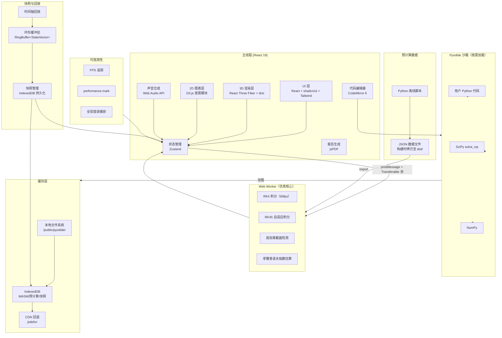

# 双摆混沌实验室 技术栈设计文档

**关联功能文档**：[功能设计_v0.md](./功能设计/功能设计_v0.md)

## 版本记录

| 日期 | 版本 | 变更内容 | 关联功能文档 | 作者 |
|------|------|----------|-------------|------|
| 2026-04-28 | v1.0 | 初始创建，全栈技术选型 | 功能设计_v0.md | Claude Code |
| 2026-04-28 | v1.1 | 对照功能模块全拆解补充：快照持久化、环形缓冲区、可观测性、CI/CD、物理回归测试 | 功能模块全拆解.md | Claude Code |
| 2026-04-28 | v1.2 | 最终产物从"单 HTML 文件"调整为"自包含 HTML5 文件夹"；移除 vite-plugin-singlefile，恢复 Vite 默认多文件输出 | — | Claude Code |

---

## 1. 项目背景与约束

### 1.1 项目定位

浏览器内的非线性动力学研究终端。从"可交互物理仿真"升级为四层递进的物理认知平台：感知层（3D + 声效）→ 分析层（分岔图 + Lyapunov 谱 + 庞加莱截面）→ 验证层（时间反演 + 受力拆解 + 能量景观）→ 创造层（可编程方程 + 实验报告）。

### 1.2 核心约束

| 约束 | 说明 |
|------|------|
| 最终产物 | **自包含 HTML5 文件夹**（`index.html` + 资源文件），可在浏览器直接打开运行 |
| 运行环境 | 纯客户端，无后端服务。离线可用（file:// 协议或本地静态服务器） |
| 资源策略 | 优先本地文件；CDN 仅作最后回退；Pyodide wheel 内置在输出目录 |
| 首屏体积 | 核心资源（JS/CSS/Worker）< 5MB；Pyodide ~18MB 按需加载 |
| 性能 | 3D 仿真 ≥ 60fps；Worker 中 ODE 积分不阻塞主线程 |

### 1.3 技术前置选择

用户已明确：**React + Pyodide（WebAssembly Python）+ Vite**，且采用**混合方案**——JS 自实现 ODE 求解器用于实时仿真，Pyodide + SciPy 仅用于 Lab 模式用户编程沙箱。

---

## 2. 技术栈概览

| # | 技术维度 | 选用技术 | 版本 | 加载时机 | 核心作用 |
|---|----------|----------|------|----------|----------|
| 1 | 前端框架 | React | 18.x | 首屏 | UI 组件化 |
| 2 | 类型系统 | TypeScript | 5.x | 开发时 | 全量类型安全 |
| 3 | 构建工具 | Vite | 5.x | 开发/构建 | 开发服务器、Tree-shaking、生产包打包（输出为自包含文件夹） |
| 4 | 资源复制 | vite-plugin-static-copy | latest | 构建时 | 将 `/public/` 下 Pyodide 离线包原样拷贝至输出目录 |
| 5 | 3D 渲染 | React Three Fiber + drei | 8.x / 9.x | 首屏 | 双摆场景、能量景观曲面、尾迹渲染 |
| 6 | 2D 图表 | D3.js 按需模块（scale / shape / axis / zoom） | 7.x | 首屏 | 分岔图、庞加莱截面、相空间图、Lyapunov 热力图 |
| 7 | 状态管理 | Zustand | 4.x | 首屏 | 仿真参数、模式切换、快照管理、多视图联动 |
| 8 | UI 样式 | Tailwind CSS | 3.x | 首屏 | 原子化 CSS，构建时 Purge 至 ~3KB |
| 9 | UI 组件 | shadcn/ui | latest | 首屏 | Slider/Tabs/Dialog/Tooltip/Button 等，Copy 模式零运行时 |
| 10 | 代码编辑器 | CodeMirror 6 + @codemirror/lang-python | 6.x | Lab 模式按需加载 | Python 语法高亮、错误行号标注、只读/编辑切换 |
| 11 | 音频合成 | Web Audio API（OscillatorNode / GainNode / BiquadFilterNode） | 原生 | 首屏（需用户手势激活） | 音高映射、和声变化、白噪声混沌听觉标记 |
| 12 | ODE 求解（实时仿真） | 自实现 RK4（固定步长 60fps）+ RK45（自适应步长，穿越检测） | — | Worker 常驻 | 实时轨迹积分、庞加莱截面事件检测 |
| 13 | ODE 求解（用户沙箱） | Pyodide + SciPy `solve_ivp` + NumPy | 0.26+ | Lab 模式按需懒加载 | 用户可编程运动方程，精确自适应积分 |
| 14 | Worker 通信 | 原生 postMessage + Transferable Float64Array 池 | — | Worker 常驻 | 零拷贝双向传输轨迹缓冲 |
| 15 | Pyodide 缓存 | 三级缓存：本地文件系统 → IndexedDB 持久化 → CDN 回退 | — | 启动时判断 | 离线可用、二次秒开、网络降级 |
| 16 | 预计算缓存 | IndexedDB + 参数网格 Hash 键 | — | 分析模式按需 | 分岔图 / Lyapunov 谱结果持久化复用 |
| 17 | 响应式测量 | ResizeObserver（2D Canvas）+ R3F 内置 resize（3D） | 原生 | 首屏 | Canvas/3D 容器尺寸自适应；Tailwind 断点布局 |
| 18 | PDF 报告 | jsPDF | 2.x | 实验报告按需 | 实验报告 PDF 生成（A4，含图表截图与参数表） |
| 19 | 离线预计算 | Python 3.11+ 本地脚本 + NumPy + SciPy | — | 构建前运行 | 参数空间扫描 → JSON 数据文件 → 编译为静态资源，运行时 fetch |
| 20 | 测试 | Vitest + @testing-library/react | 1.x | 开发时 | 单元测试（ODE 求解器精度）+ 组件测试 |
| 21 | 快照持久化 | IndexedDB（快照专属 store） | — | 用户触发 | 快照完整状态（参数+尾迹+缩略图）读写，键 `snapshot-{uuid}` |
| 22 | 轨迹环形缓冲 | `RingBuffer<StateVector>`（固定容量 6000 = 100s） | — | 仿真运行时 | 历史回放时间轴数据源，O(1) 按时间索引回溯，支持分叉克隆 |
| 23 | 前端可观测性 | `performance.mark/measure` + 自实现 FPS tracker + `onerror`/`unhandledrejection` 全局捕获 | 原生 | 首屏 | FPS、Worker 耗时、Pyodide 加载状态、未捕获异常写入 Zustand debug store |
| 24 | CI/CD | GitHub Actions（build → artifact → Pages 部署） | — | 提交时 | 自动化构建检查 + `dist/` 文件夹产物 + 可复现评审版本 |
| 25 | 物理回归测试 | Vitest + 三项物理验证断言（小角度 <2%、周期吻合、能量漂移 <0.5%） | — | 开发时/CI | 每次改动自动验证不破坏物理正确性 |

---

## 3. 架构设计

### 3.1 架构分层图



### 3.2 核心数据流

**实时仿真帧循环**：

```
Worker(RK4 积分 2s 轨迹)
  → postMessage(buf, [buf.buffer])  // Transferable 零拷贝
  → 主线程写入 Zustand { angle1, angle2, velocity1, velocity2, kineticEnergy, ... }
  → React 调度:
    ├─ R3F: 更新摆臂旋转 / 末端球位置 / 尾迹追加
    ├─ D3: 相空间图增量描点 / 能量曲线追加
    ├─ Web Audio API: 更新 Oscillator.frequency(音高) / Oscillator.type(音色)
    └─ 轨迹缓冲消耗完 → pool.release(buf) → 归还池
```

**Lab 模式沙箱执行**：

```
用户修改 Python 方程 → CodeMirror 编辑
  → 点击"运行" → Pyodide.runPythonAsync(code)
  → code 内调用 SciPy solve_ivp(用户自定义 f(t,y))
  → 返回轨迹数组 → 通过 JsProxy 转换为 TypedArray
  → Zustand store 更新
  → 3D 场景 + 2D 图表同步切换至新模型
```

**预计算数据管线**：

```
开发机:  Python 脚本(参数空间扫描, 100×100 网格, solve_ivp 批量)
  → 输出 JSON (Lyapunov 指数矩阵 / 分岔采样序列)
  → /src/data/ 目录
  → Vite build: JSON 拷贝至 dist/assets/
  → 运行时首次加载 → IndexedDB 缓存（键 = 网格 hash）
  → D3.js Canvas 渲染热力图 / 散点图
```

### 3.3 TypedArray 池设计

```
┌─ 主线程 ─────────────────────────────────────────────┐
│                                                      │
│  class Float64Pool {                                 │
│    constructor(n, size) {                            │
│      this.buffers = Array(n).fill(null)              │
│        .map(() => new Float64Array(size));           │
│      this.free = [...Array(n).keys()];               │
│    }                                                 │
│    acquire() { ... }  // 取空闲块                     │
│    release(buf) { ... } // 归还                      │
│  }                                                   │
│                                                      │
│  每帧: buf = pool.acquire()                          │
│        worker.postMessage({cmd:'step', buf},         │
│                           [buf.buffer])  // transfer │
│                          │                           │
│  ────────────────────────┼───────────────────────────│
│  ┌── Web Worker ────────┼───────────────────────────┐│
│  │                       ▼                           ││
│  │  onmessage = ({data: {cmd, buf}}) => {            ││
│  │    rk4Step(buf, dt, 2000)  // 积分 2s            ││
│  │    postMessage({cmd:'done', buf}, [buf.buffer])   ││
│  │  }                                                ││
│  └───────────────────────────────────────────────────┘│
│                         │ transfer 回                │
│  渲染: buf 中轨迹 → Zustand → R3F + D3 + Web Audio   │
│  渲染完: pool.release(buf)                           │
└──────────────────────────────────────────────────────┘
```

池规模：10 块 × 4000 元素 Float64Array ≈ 320KB，覆盖 2 秒轨迹缓冲区（2000 步 × 4 状态变量）。

---

## 4. 核心功能实现方案

### 4.1 3D 实时双摆仿真

- **技术支撑**：React Three Fiber + drei（OrbitControls、Line、Sphere）+ 自实现 RK4（Worker）+ Zustand
- **Worker 积分策略**：每次求解 2 秒轨迹（120 步 × 固定 dt = 1/60s），缓冲数组返回主线程。缓冲区 80% 耗尽时触发下一次求解
- **视角系统**：drei `OrbitControls` 基础旋转/缩放 + Zustand `cameraPreset` 切换（实验员/上帝/混沌三种视角，对应不同相机位置与目标点）
- **尾迹渲染**：R3F `<Line>` 组件，顶点着色器根据 `velocity` 属性映射颜色（THREE.BufferGeometry + vertexColors），FS 中混合 `trailOpacity`。持久度用环形缓冲区控制
- **响应式**：R3F `<Canvas>` 的 `resize` prop 自动跟随父容器；Tailwind 断点控制布局列数

### 4.2 蝴蝶效应分屏对比

- **技术支撑**：双 `<Canvas>` Viewport + 共享 Zustand store（两个独立参数 slice）
- **实现要点**：
  - 两个 3D Viewport 各自绑定独立的 Worker 实例（Worker A / Worker B）
  - 差异溯源面板：从 Store 读取 `{theta1A, theta2A, theta1B, theta2B}` 计算 `|Δθ|`
  - 分离警报：Zustand `separationState` 派生值 → 超过阈值时触发 CSS 动画脉冲提示 + 白噪声混响
- **同步控制**：播放/暂停/重置通过 `syncControlBus` 广播至两个 Worker

### 4.3 声音化系统

- **技术支撑**：Web Audio API（`AudioContext` + `OscillatorNode` + `GainNode` + `BiquadFilterNode`）
- **音高映射**：`osc.frequency.value = 220 + Math.abs(theta2Dot * 200)`，clamp 至 55-1760Hz
- **和声映射**：双摆夹角 → 第二振荡器频率偏移量（纯五度 = 3:2 频率比；不协和 = 非整数比）
- **混沌听觉标记**：Lyapunov 估算 > 0 时 → `GainNode` 混入白噪声（`AudioBufferSourceNode` 填充随机采样）+ `ConvolverNode` 混响
- **静音默认**：`AudioContext` 需用户手势激活（点击"开启声效"按钮），符合浏览器自动播放策略

### 4.4 时间反演实验

- **技术支撑**：Worker 中反向积分（dt → -dt）+ 保存正向轨迹历史
- **精确反演模式**：当前状态为初值，从尾迹历史中采样正向轨迹点，反序播放（纯视觉回溯）
- **数值反演模式**：以当前状态为初值，调用 `rk4Step(state, -dt)`，与尾迹历史分段比较 `|Δposition|`，实时绘制漂移距离曲线

### 4.5 庞加莱截面

- **技术支撑**：Worker 中 RK45 自适应积分 + 线性插值穿越检测
- **截面条件**：θ₁ = 0 且 θ̇₁ > 0（默认），可配置
- **穿越检测**：在每次 RK45 子步中检查 `sign(θ₁(t)) ≠ sign(θ₁(t+dt))`，触发时在区间内二分查找精确穿越点，插值得到 `(θ₂, θ̇₂)`
- **渲染**：D3.js 散点图，新点以 alpha 渐变加入；支持叠加"当前轨线"与"历史基准轨线"两种颜色

### 4.6 能量景观地形图

- **技术支撑**：R3F 半透明 `<mesh>` + 自定义 `shaderMaterial`
- **曲面生成**：Worker 中离线计算 V(θ₁, θ₂) 在 100×100 网格上的值 → 生成 THREE.BufferGeometry
- **实时光点**：从 Zustand 读取当前 `(θ₁, θ₂)` → 发光小球在曲面上的 3D 坐标 → `<Sphere>` 跟随
- **等高线投影**：底部平面贴 Canvas 纹理（D3 `contourDensity` → canvas → THREE.CanvasTexture）

### 4.7 白盒受力拆解

- **技术支撑**：R3F `<Arrow>`（drei 或自实现）+ Zustand 数值标签 + 切换面板
- **力矢量叠加**：由 Worker 在每步积分中顺便计算 `[重力, 张力1, 张力2, 切向惯性力, 法向惯性力]`，各分量写入 TypedArray 返回
- **分量分解面板**：纯 React 表格，笛卡尔/极坐标/自然坐标切换通过 Zustand `coordSystem` 控制计算逻辑
- **历史极值**：Worker 维护 `T_max, T_min` 滑动窗口

### 4.8 用户可编程沙箱

- **技术支撑**：Pyodide + SciPy + CodeMirror 6
- **安全边界**：
  - 白名单 import：`numpy`, `scipy.integrate`, `math`
  - `exec()` 超时：`Pyodide.setStdout({ batched: ... })` + 主线程 `setTimeout(5000)` 中断
  - 错误捕获：Pyodide 异常 → 提取行号 → 映射中文错误词典 → CM6 `setDiagnostics`
- **预设模板**：三个模板代码字符串（弹簧摆 / 受迫摆 / 磁力摆），CM6 `doc.setText(template)`
- **即时反馈**：`solve_ivp` 结果数组 → JsProxy 转 Float64Array → 注入 Zustand → 3D 场景立即切换

### 4.9 预计算数据：Lyapunov 谱 + 分岔图

- **技术支撑**：本地 Python 脚本（NumPy + SciPy）→ JSON → 构建时拷贝至 dist/ + IndexedDB 缓存
- **Lyapunov 热力图**：脚本对 100×100 参数网格批量运行 `scipy.integrate.solve_ivp`，用 Benettin 算法估计最大 Lyapunov 指数 → 输出 100×100 的浮点矩阵 JSON
- **分岔图**：固定其他参数，扫描 θ₁(0) 从 0 到 2π，每步记录 θ₂ 的局部极大值集合 → 输出 JSON 数组
- **渲染**：D3.js Canvas——Lyapunov 用 `d3-scale-chromatic` 色阶 drawImage；分岔图用 Canvas scatter，支持 `d3-zoom` 框选放大
- **缓存**：IndexedDB 键 = 参数网格 hash（`SHA256(params).slice(0,16)`），首次渲染后持久化，后续相同网格免计算

### 4.10 一键实验报告生成

- **技术支撑**：jsPDF + Canvas.toBlob（截图）
- **报告结构**：页眉标题 + 参数表（jsPDF autoTable）+ 4 帧截图（初始/中期/分离/稳态）+ 能量图（Canvas.toBlob）+ 混沌判定语句 + 误差分析表
- **排版**：A4 竖版，12pt 字号，页脚附加团队署名 + 时间戳

### 4.11 故事模式

- **技术支撑**：Zustand 故事状态机 + `requestAnimationFrame` 时间轴
- **脚本编排**：状态机定义了 7 个阶段，每阶段在预定时间窗口内自动执行：参数渐变（lerp）、相机动画（drei `CameraControls` 程序化路径）、字幕淡入淡出、按钮脉冲高亮
- **打断机制**：用户点击任意位置 → `storyMachine.pause()` → 恢复手动控制；提供"重播故事"按钮重置状态机

### 4.12 快照与历史回放

- **技术支撑**：IndexedDB（快照持久化）+ `RingBuffer<StateVector>`（轨迹历史）+ shadcn/ui `Slider`（时间轴）+ Canvas.toDataURL（缩略图）
- **快照保存**：
  - 完整状态 = 参数表 + 当前 StateVector + 尾迹 Float64Array + Canvas 64px 缩略图（toDataURL）
  - 写入 IndexedDB 独立 object store `snapshots`，键 = `snapshot-{uuid}`
  - 缩略卡片排列：从 IndexedDB 读取缩略图 → React 组件渲染，点击恢复
- **双快照对比**：选择两个快照 → 参数差异表（Zustand diff selector）+ 轨迹叠加（两个 R3F Line 不同颜色半透明）
- **环形缓冲区**：
  - `RingBuffer` 固定容量 6000（= 100 秒 × 60fps），每个元素 = `{t, θ₁, θ̇₁, θ₂, θ̇₂, E_k, E_p}`
  - 写入 O(1)，按时间索引回溯 O(1)
  - 作为时间轴 Slider 的数据源
- **分叉执行**：用户在时间轴上选取历史时刻 → `forkState = ringBuffer.at(t)` → `new Worker({ initialParams: forkState })` → 新 3D Viewport 并行运行，原轨迹以半透明保留

---

## 5. 缓存与加载设计

### 5.1 首屏加载流程

```
浏览器加载 index.html
  → 解析 JS bundle（React 核心 + 3D 引擎） + 创建 Worker
  → 渲染：黑色背景 + 加载动画 + 混沌名言轮播
  → 并行：
    ├─ Worker 初始化（即时，纯 JS）
    ├─ Web Audio 等待用户手势
    └─ fetch 预计算 JSON（非阻塞，首次命中后 IndexedDB 缓存）
  → Worker ready → 启动默认参数仿真 → 淡入 3D 场景
```

### 5.2 Pyodide 三级缓存

```
┌──────────────────────────────────────────────────────┐
│ 第一层：本地文件系统（最高优先级）                      │
│ /public/pyodide/ → Vite copy → 与 index.html 同级     │
│ 离线 file:// 协议直接读取，0ms 延迟                    │
├──────────────────────────────────────────────────────┤
│ 第二层：IndexedDB（持久化缓存）                        │
│ 首次加载成功后，Pyodide 核心资源以 ArrayBuffer 存入    │
│ 缓存键：`pyodide-core-{VERSION}` / `numpy-{VERSION}`   │
│ 二次访问：先查 IndexedDB → 命中直接注入，零网络请求    │
├──────────────────────────────────────────────────────┤
│ 第三层：CDN 回退（仅在线环境）                         │
│ 本地文件不存在 + IndexedDB 未命中 → jsdelivr CDN 拉取  │
│ 拉取成功后自动回填 IndexedDB                           │
└──────────────────────────────────────────────────────┘
```

### 5.3 预计算数据缓存

- IndexedDB 存储：键 = `{type}-{gridHash}`（如 `lyapunov-a1b3f2e8`）
- 有效期：永久，除非功能设计文档中的参数范围变化导致 Grid hash 变更
- 清理策略：LRU，最多保留 10 组预计算结果（约 5MB 存储上限）

### 5.4 快照 IndexedDB 存储

- **Object Store**：`snapshots`，键路径 `id`（UUID v4）
- **单条记录结构**：
  ```
  {
    id: "snapshot-{uuid}",
    timestamp: "2026-04-28T10:30:00Z",
    params: { m1, m2, L1, L2, theta1, theta2, omega1, omega2, g, damping },
    stateVector: Float64Array(4),     // 当前 [θ₁, θ̇₁, θ₂, θ̇₂]
    trail: Float64Array(N*3),         // 尾迹顶点坐标
    thumbnail: "data:image/png;base64, ...",  // 64×64px
    mode: "explore" | "analyze" | "lab",
    label: "用户自定义标签"              // 可选
  }
  ```
- **容量估算**：单快照 ≤ 50KB（含 1000 步尾迹），50 个快照 ≈ 2.5MB
- **清理策略**：最近使用优先，上限 50 个；超出时提示删除最旧快照

---

## 6. 响应式策略

| 端 | 布局 | 功能降级 |
|----|------|----------|
| 桌面（1920+） | 三栏：左控制面板 / 中 3D / 右图表；分析模式可全屏 | 完整功能 |
| 笔记本（1366-1920） | 两栏：左控制 + 中 3D；图表以标签页切换 | 关闭阴影，尾迹长度减半 |
| 平板（768-1366） | 单栏：上 3D / 下抽屉控制面板 | 关闭声音化；禁用预计算（仅实时） |
| 手机（<768） | 单栏：3D 全屏 + 悬浮控制按钮 | 仅探索模式；禁用用户编程编辑器；尾迹关闭 |

- **3D Canvas**：R3F `<Canvas resize>` 自动跟随父容器 SVGG
- **2D Canvas**：自定义 `useContainerSize` hook（ResizeObserver + dpr 缩放）
- **布局**：Tailwind `lg:grid-cols-3 md:grid-cols-2` 响应式断点

---

## 7. 异常处理矩阵

| 用户行为 / 场景 | 系统响应 |
|------|----------|
| 输入非物理参数（负质量/零摆长） | 输入框红框震动拒绝，Tooltip 提示合理范围；3D 场景冻结 |
| 用户 Python 代码超时（>5s） | Pyodide 中断 + CM6 错误行号高亮 + 侧边友好错误翻译 |
| 用户 Python 代码异常 | Pyodide traceback → 解析行号 → CM6 `setDiagnostics` + 中文错误词典映射 |
| 长时间运行（>10 分钟） | 自动降低积分精度（dt 从 1/60 增至 1/30），Tailwind toast 提示 |
| 庞加莱截面长期无穿越（>5s） | 提示"当前轨迹可能不穿过所选截面，建议更换截面条件" |
| 预计算数据加载失败 | 优雅降级为实时估算模式，提示"离线模式：高级分析需预计算数据" |
| 浏览器后台运行 | `document.visibilitychange` → 暂停仿真 + 静音；切回提示"已暂停，点击继续" |
| Pyodide 三层缓存全失败 | 提示"Python 沙箱不可用：请检查网络连接或刷新重试"，保留 JS 仿真 |
| Worker 异常崩溃 | 主线程 `onerror` 捕获 → 重建 Worker → 恢复当前参数 → toast 提示 |

---

## 8. 安全设计

| 维度 | 方案 |
|------|------|
| Pyodide 沙箱 | WASM 沙箱天然隔离，无文件系统访问权限；Python `exec()` 白名单 import |
| 代码执行超时 | 主线程 `setTimeout + Pyodide.interruptBuffer` 双重保障，5 秒强制中断 |
| XSS 防护 | React 默认转义 + shadcn/ui 组件无 dangerouslySetInnerHTML |
| 无用户数据采集 | 纯客户端运行，不发送任何用户数据至外部服务 |
| CDN 回退 | 仅在有网络时触发，且只向 jsdelivr 请求开源 Pyodide wheel，不传输用户数据 |
| 快照数据隔离 | IndexedDB 存储仅限当前域名，不可跨域访问；快照不含任何 PII |

---

## 9. 开发与构建流程

### 9.1 项目目录结构（建议）

```
chaos-pendulum/
├── public/
│   └── pyodide/                # Pyodide 离线包（Vite copy-public-dir）
│       ├── pyodide.js
│       ├── pyodide.asm.wasm
│       └── ...
├── scripts/
│   └── precompute/             # 本地 Python 预计算脚本
│       ├── lyapunov_spectrum.py
│       └── bifurcation.py
├── src/
│   ├── main.tsx                # 入口
│   ├── App.tsx
│   ├── components/
│   │   ├── ui/                 # shadcn/ui 组件（Copy 模式）
│   │   ├── simulation/         # 3D 场景、尾迹、摆组件
│   │   ├── analysis/           # 分岔图、庞加莱截面、热力图
│   │   ├── lab/                # CodeMirror 编辑器、Pyodide 桥接
│   │   ├── story/              # 故事模式状态机与编排
│   │   └── layout/             # 导航栏、模式切换、响应式布局
│   ├── stores/                 # Zustand stores
│   ├── workers/                # Web Worker (ODE 积分、截面检测)
│   ├── audio/                  # Web Audio 声音化引擎
│   ├── data/                   # 预计算 JSON 数据文件
│   ├── hooks/                  # 自定义 hooks
│   ├── lib/                    # 工具函数、ODE 求解器、缓存层
│   └── types/                  # TypeScript 类型定义
├── vite.config.ts
├── tailwind.config.ts
├── tsconfig.json
└── package.json
```

### 9.2 构建命令链

```bash
# 1. 预计算（手动触发，更新数据时执行）
cd scripts/precompute && python lyapunov_spectrum.py --output ../../src/data/
cd scripts/precompute && python bifurcation.py --output ../../src/data/

# 2. 开发
vite dev

# 3. 构建生产包
vite build  # 输出自包含 dist/ 文件夹

# 4. 测试
vitest --run
```

### 9.3 Vite 关键配置（vite.config.ts 要点）

- `vite-plugin-static-copy`：复制 `/public/pyodide/` 到 `dist/` 输出目录
- `vite-plugin-compression`（可选，部署至 CDN 时开启）：构建时 Brotli 压缩，配合 Nginx 静态预压缩
- `resolve.alias`：`@/` → `src/`
- `worker`：`new Worker(new URL('./workers/ode-worker.ts', import.meta.url), { type: 'module' })`
- `build.outDir`：`dist/`，产物结构：
  ```
  dist/
  ├── index.html
  ├── assets/
  │   ├── index-[hash].js       # React + R3F + D3 bundle
  │   ├── index-[hash].css      # Tailwind Purge 后 CSS
  │   └── data-[hash].json      # 预计算数据
  ├── pyodide/                    # 离线 Python 运行时
  └── worker-[hash].js           # Web Worker 独立 chunk
  ```

### 9.4 CI/CD 与自动化测试

#### GitHub Actions 流水线

```
push / PR → 三阶段流水线：

Stage 1 — 代码检查:
  ├─ tsc --noEmit（类型检查）
  ├─ ESLint（代码规范）
  └─ Prettier --check（格式）

Stage 2 — 测试:
  ├─ vitest --run（单元测试 + 组件测试）
  ├─ 物理回归测试:
  │   ├─ smallAngleRegression.ts  →  assert(deviation < 2%)
  │   ├─ singlePendulumRegression.ts → assert(period ≈ 2π√(L₁/g), tol 1%)
  │   └─ energyConservation.ts    → assert(drift < 0.5% over 1000s)
  └─ 预计算数据校验:
      └─ assert(SHA256(newGrid) === storedHash || gridChanged)

Stage 3 — 构建:
  ├─ vite build（生成 dist/ 文件夹）
  ├─ upload artifact（dist/ 打包为 zip）
  └─ deploy to GitHub Pages（手动触发 / release 自动）
```

#### 物理回归测试设计

```typescript
// vitest 中运行，在 Node 环境调用同一个 RK4 实现
describe('物理验证回归', () => {
  test('小角度线性化偏差 < 2%', () => {
    const result = rk4Simulate({ theta1: 0.052, theta2: 0.034 }, 10); // ~3°
    const theory = linearizedAnalytic({ theta1: 0.052, theta2: 0.034 }, 10);
    expect(relativeDeviation(result, theory)).toBeLessThan(0.02);
  });

  test('单摆退化周期吻合', () => {
    const result = rk4Simulate({ m2: 0 }, 20);
    const T = detectPeriod(result.theta1);
    expect(T).toBeCloseTo(2 * Math.PI * Math.sqrt(1 / 9.81), 1); // tol 1%
  });

  test('能量守恒 1000s 漂移 < 0.5%', () => {
    const result = rk4Simulate({ damping: 0 }, 1000);
    const drift = maxEnergyDrift(result.E);
    expect(drift).toBeLessThan(0.005);
  });
});
```

#### 前端可观测性

```
┌──────────────────────────────────────────────────────┐
│  自实现监控（零外部依赖）                               │
│                                                      │
│  FPS 追踪:                                            │
│    rAF 帧间差值滑动平均（最近 60 帧）                    │
│    → 写入 Zustand debugStore.fps                       │
│    → shadcn/ui Tooltip 悬停显示（开发/调试模式）         │
│                                                      │
│  Worker 耗时:                                         │
│    performance.mark('rk4-start') / mark('rk4-end')    │
│    performance.measure('rk4-duration', ...)           │
│    → 滑动窗口记录最近 100 次耗时分布                     │
│                                                      │
│  错误捕获:                                             │
│    window.onerror + window.unhandledrejection         │
│    → 写入 Zustand debugStore.errors[]（环形 50 条）     │
│    → shadcn/ui Sheet 面板展示（开发模式按 Ctrl+Shift+D） │
│                                                      │
│  Pyodide 加载追踪:                                     │
│    loadPyodide({ onProgress(pct) → debugStore })      │
│    → Progress 组件百分比 + 阶段标记                     │
└──────────────────────────────────────────────────────┘
```

---

## 10. 风险与替代方案

| 风险点 | 影响 | 缓解措施 | 后备方案 |
|--------|------|----------|----------|
| 首屏 bundle 体积过大（> 5MB） | 加载缓慢，体验差 | 代码分割、按需懒加载 Pyodide/CM6；Tailwind Purge；D3 模块化引入 | 将重型依赖进一步拆分为独立 chunk，延迟加载 |
| Pyodide CDN 不可达（中国网络） | Lab 模式不可用 | 三级缓存（本地 → IDB → CDN）；/public/ 目录预置离线包 | 纯 JS 实现简化沙箱（仅支持预设模板） |
| Worker ODE 求解数值不稳定 | 极端参数下积分发散 | RK45 自适应步长 + 步长上限 clamp；检测 NaN 自动回退 | 降低仿真速度，增大积分容差 |
| 移动端 WebGL 性能不足 | 帧率 < 30fps | 降低几何细节、关闭尾迹、禁用阴影；Tailwind 断点评估 | 提示"请使用桌面端体验完整功能" |
| 预计算脚本维护成本 | 参数范围变更需重新运行 | 脚本参数化 + README 运行指南 + 输出 hash 校验 | 降级为实时低精度估算 |

---

## 11. 决策记录（ADR）

### ADR-001：JS 自实现 ODE 求解器用于实时仿真，Pyodide + SciPy 仅用于用户沙箱

- **背景**：需要权衡实时仿真性能与用户可编程灵活性
- **考量选项**：(A) 全部用 Pyodide + SciPy 统一；(B) JS 实时 + Pyodide 沙箱混合
- **决策**：选 B
- **理由**：(1) 避免 Pyodide 冷启动延迟阻塞首屏仿真；(2) Worker 中 JS ODE 性能可达 60fps；(3) 沙箱只需 Lab 模式时加载 ~18MB Pyodide；(4) Worker 可常驻，不依赖 WASM 初始化
- **后果**：需维护 JS 和 Python 两套 ODE 实现，但 JS 端代码量 < 100 行，维护成本可控

### ADR-002：Worker 通信使用原生 postMessage + Transferable 池而非 Comlink

- **背景**：每帧需高频传输 Float64Array 轨迹缓冲
- **考量选项**：(A) Comlink（RPC 风格，自动序列化）；(B) 原生 postMessage + Transferable 池
- **决策**：选 B
- **理由**：(1) Transferable 零拷贝，高帧率下 GC 压力可控；(2) 池化管理避免频繁创建 ArrayBuffer；(3) 免除 Comlink 额外依赖
- **后果**：需手写消息分发，但随着消息类型有限（~5 种），复杂度可控

### ADR-003：UI 组件选 shadcn/ui 而非 Ant Design / MUI

- **背景**：需要 Slider、Tabs、Dialog、Tooltip 等组件且体积可控
- **考量选项**：(A) Ant Design；(B) MUI；(C) shadcn/ui
- **决策**：选 C
- **理由**：(1) Copy 模式无运行时依赖；(2) Tailwind CSS 原子类天然 Purge 到只保留使用的样式；(3) Radix 原语提供无障碍支持；(4) 不会强行引入 CSS-in-JS 运行时
- **后果**：组件需手动 Copy 到项目中，升级时需手动同步

### ADR-004：前端可观测性自实现而非引入外部 SDK

- **背景**：INF-01 要求 FPS / Worker 耗时 / Pyodide 加载状态 / 全局错误的监控
- **考量选项**：(A) 引入 Sentry / Datadog RUM；(B) 自实现轻量监控
- **决策**：选 B
- **理由**：(1) 自包含约束禁止引入大型外部 SDK；(2) 纯客户端无服务端上报终点，Sentry 的采集→发送链路不成立；(3) 需求仅为开发调试与评审现场快速定位，不涉及线上聚合分析；(4) `performance.mark/measure` + FPS 滑动平均 + 全局错误捕获，全部代码 < 100 行
- **后果**：无集中式仪表板，调试时需在浏览器内查看 Zustand debug store；若后续需要线上监控，可补充自实现的上报端点

### ADR-005：轨迹历史使用固定容量环形缓冲区而非无限增长数组

- **背景**：DAT-03 时间轴回溯需要存储历史状态
- **考量选项**：(A) 无限增长 `Array.push`；(B) 固定容量 `RingBuffer`
- **决策**：选 B
- **理由**：(1) 仿真可无限运行，无限增长会导致内存泄漏；(2) 6000 容量 = 100 秒 × 60fps，覆盖用户回溯的合理窗口；(3) O(1) 写入和索引，无 GC 抖动；(4) 分叉时 O(n) 切片克隆可接受
- **后果**：超过 100 秒前的历史不可回溯；如需更长时间窗口，可通过调整 `CAPACITY` 常量扩展

---

*本文档由 Claude Code 辅助生成，建议经技术负责人评审后生效。*
