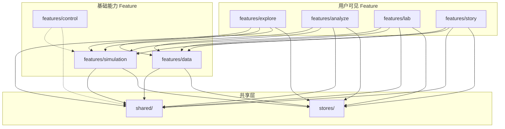

# 双摆非线性动力学虚拟仿真实验 项目结构设计

## 版本记录

| 日期 | 版本 | 变更内容 |
|------|------|----------|
| 2026-04-28 | v1.0 | 初始创建，Feature-Based 结构设计 |
| 2026-06-13 | v2.0 | 全面重构：Clean Architecture 五层模型落地，删除 system feature，清理所有死代码 |
| 2026-06-17 | v3.0 | 契约驱动开发落地：全量 contracts/ 目录 + analyze/data/explore 大幅充实 + 新增 control feature + shared 层扩展 |

---

## 1. 架构模型

采用 **Clean Architecture 五层模型**，依赖方向向内：

```
View          ← 渲染、事件转发、GUI 专属状态（isHovered, scrollY）
  │  依赖方向向内
  ▼
ViewModel     ← 跨介质 UI 状态（isLoading, error, selectedTab）、Zustand Store
  │
  ▼
Application   ← 无状态用例编排、端口接口定义、DTO
  │
  ▼
Domain        ← 实体、值对象、纯业务规则、纯函数
  ↑
  │  实现端口
  │
Infrastructure ← API/Worker/IndexedDB/Web Audio 实现
```

### 铁律

| 层 | 可以依赖 | 禁止依赖 |
|----|---------|---------|
| Domain | 无（shared/domain 类型除外） | React、Zustand、Worker API |
| Application | Domain | React、Zustand、axios |
| ViewModel | Application、Domain | Infrastructure 实现 |
| View | ViewModel | Application、Domain、Infrastructure |
| Infrastructure | Application（实现端口） | ViewModel、View |

### 契约层（contracts/）

v3.0 新增 **契约层**，位于各 feature 的 `contracts/` 目录下，是契约驱动开发的核心产物。契约文件定义：
- **端口接口**（Port Interface）—— Application 层依赖的抽象
- **异常类型**（Exceptions）—— 该 feature 的错误码字典
- **类型契约**（Types Contract）—— 跨模块共享的类型定义

契约文件独立于五层，被 Application 和 Infrastructure 共同引用，不打破依赖方向。

---

## 2. 整体结构概览

```
chaos-pendulum/
├── public/
│   ├── pyodide/                           # Pyodide 离线 WASM 包
│   └── assets/                            # 预计算 JSON 数据（运行时 fetch 加载）
│       ├── bifurcation-*.json             # 分岔图预计算数据
│       ├── lyapunov_max-*.json            # Lyapunov 指数预计算数据
│       ├── energy_curvature-*.json        # 能量曲率预计算数据
│       └── layer_manifest.json            # 数据层清单
├── scripts/precompute/                    # Python 离线预计算脚本
│   ├── run_all.py                         # 全量预计算入口
│   ├── bifurcation.py                     # 分岔图计算
│   ├── lyapunov_spectrum.py               # Lyapunov 谱计算
│   ├── common.py                          # 共享工具函数
│   └── config.py                          # 参数配置
├── src/
│   ├── main.tsx                           # 应用入口
│   ├── App.tsx                            # 根组件
│   ├── shared/                            # 跨 Feature 共享层（零业务逻辑）
│   │   ├── application/ports/            # 共享端口接口（INotificationPort）
│   │   ├── domain/valueObjects/          # 共享值对象（物理类型、仿真类型、应用类型）
│   │   ├── viewModel/hooks/              # 共享 Hook（useContainerSize, useDeviceType 等）
│   │   ├── view/components/              # 共享 UI（shadcn/ui, AppShell, NavBar, ToastProvider, DebugPanel）
│   │   ├── infrastructure/               # 共享基础设施
│   │   │   ├── adapters/                 # 端口实现（NotificationAdapter）
│   │   │   ├── error-handling/           # 错误码字典、Toast 通知、全局错误处理
│   │   │   ├── storage/                  # IndexedDB 封装、预计算数据加载器
│   │   │   ├── observability/            # FPS 追踪、performance.mark、错误捕获
│   │   │   ├── audio/                    # Web Audio 声音化引擎
│   │   │   └── commandBus.ts             # 事件总线（解耦 Worker ↔ Store）
│   │   ├── lib/                          # 通用工具函数（cn className 合并）
│   │   ├── constants/                    # 断点常量等
│   │   └── data/                         # 混沌名言等静态数据
│   ├── features/                         # 业务功能（Feature-Based + 五层架构 + 契约层）
│   │   ├── simulation/                   # [基础能力] 核心仿真引擎
│   │   ├── control/                      # [基础能力] 参数面板与模式导航（契约层已就绪，实现待迁移）
│   │   ├── explore/                      # [可见模式] 探索模式
│   │   ├── analyze/                      # [可见模式] 分析模式
│   │   ├── lab/                          # [可见模式] 实验模式
│   │   ├── story/                        # [可见模式] 故事模式
│   │   └── data/                         # [基础能力] 数据与记录系统
│   ├── stores/                           # 全局 Store
│   │   ├── useAppStore.ts                # 全局状态（currentMode, deviceType, loadingState）
│   │   ├── rootStore.ts                  # 聚合各 feature 的 viewModel/stores/ slice
│   │   └── __tests__/                    # Store 测试
│   └── styles/                           # 全局样式
├── docs/                                 # 项目文档
├── DESIGN.md                             # 设计系统文档
└── 配置文件（vite.config.ts, tailwind.config.ts, tsconfig.json, package.json）
```

---

## 3. 各 Feature 完整结构

### 3.1 simulation — 核心仿真引擎

```
simulation/
├── contracts/                      ← 契约文件（9个）
│   ├── physics-engine.contract.ts  ← 物理引擎端口
│   ├── worker-gateway.contract.ts  ← Worker 网关端口
│   ├── simulation-scheduler.contract.ts ← 调度器端口
│   ├── energy-monitor.contract.ts  ← 能量监控端口
│   ├── phase-space.contract.ts     ← 相空间端口
│   ├── history-repository.contract.ts ← 历史存储端口
│   ├── boot-dependencies.contract.ts ← 启动依赖端口
│   ├── types.contract.ts           ← 共享类型定义
│   ├── exceptions.ts               ← 异常定义
│   └── index.ts                    ← barrel
├── domain/
│   └── services/                   ← ODE 右端函数、RK4/RK45 积分器、状态向量计算（纯数学，零框架依赖）
│       ├── derivatives.ts
│       ├── integrators.ts
│       └── stateVector.ts
├── application/
│   └── useCases/                   ← 启动编排（BootSequenceUseCase）
├── viewModel/
│   ├── stores/                     ← simulationSlice, historySlice, simulationStore
│   ├── hooks/                      ← useSimulationControls, useEnergyMonitor, useAutoPause,
│   │                                  useBootSequence, useSimulationBridge, useWorkerRecovery,
│   │                                  useEnergyCanvasRendering, usePhaseSpace,
│   │                                  usePhaseSpaceCanvasRendering, useLongRunningDetector
│   └── selectors/                  ← physics, methods, paramMeta, presets
├── view/
│   └── components/                 ← ParamPanel, ParamSlider, PresetButtons, MethodSelector,
│                                      EnergyCanvas, EnergyCanvasUtils, EnergyMonitorPanel,
│                                      PhaseSpaceCanvas, PhaseSpaceCanvasUtils, PhaseSpacePanel,
│                                      BootManager, ErrorScreen, LoadingScreen
├── infrastructure/
│   ├── worker/                     ← ode-worker, Float64Pool, Scheduler, Bridge, SchedulerFactory,
│   │                                  WorkerFactory, WorkerGateway, WorkerRecovery
│   ├── adapters/                   ← ErrorHandlerAdapter, ObservabilityBootstrapAdapter,
│   │                                  PrecomputeBootstrapAdapter, PyodideBootstrapAdapter,
│   │                                  SchedulerProviderAdapter, WorkerFactoryAdapter
│   └── repositories/               ← SimulationHistoryRepo
├── __tests__/                       ← contracts.test, engine.test, energy.test, params.test, phaseSpace.test
├── store.ts                         ← feature Store 封装
├── history.ts                       ← 历史记录枚举/常量
├── types.boot.ts                    ← 启动流程类型
└── index.ts                         ← 公共 barrel
```

### 3.2 control — 参数面板与模式导航

```
control/
├── contracts/                      ← 跨模块契约（4个）
│   ├── parameter-panel.contract.ts ← 参数面板端口（被 simulation/view 实现）
│   ├── navigation.contract.ts      ← 导航端口（被 shared/view/layout 实现）
│   ├── exceptions.ts               ← 异常定义
│   └── index.ts                    ← barrel
├── domain/                         ← （待填充）
├── application/                    ← （待填充）
│   ├── ports/
│   └── useCases/
├── viewModel/                      ← （待填充）
│   ├── stores/
│   └── hooks/
├── view/                           ← （待填充）
│   ├── components/
│   └── pages/
├── infrastructure/                 ← （待填充）
│   └── repositories/
└── README.md                       ← 模块职责说明
```

> **说明**：control 的契约定义了参数面板和导航的抽象接口，当前实现仍在 `simulation/view/`（参数面板）和 `shared/view/layout/`（导航）中。control 提供跨模块契约治理，实现将逐步迁移。

### 3.3 explore — 探索模式

```
explore/
├── contracts/                      ← 契约文件（6个）
│   ├── butterfly-effect.contract.ts
│   ├── sonification.contract.ts
│   ├── time-reversal.contract.ts
│   ├── types.contract.ts
│   ├── exceptions.ts
│   └── index.ts
├── domain/                         ← 蝴蝶效应计算、漂移/分离计算
│   ├── drift-calculator.ts
│   └── separation-calculator.ts
├── application/                    ← 用例编排
│   ├── ports/
│   └── useCases/
├── viewModel/
│   ├── stores/                     ← exploreSlice, butterflySlice
│   ├── hooks/                      ← useButterflyMode, useButterflySimulation, useChaosUpdater,
│   │                                  useSceneController, useSceneAnimation, useTrailBuffer,
│   │                                  useForceAnalysis, useSonification, useReversalRunner,
│   │                                  useChaosIndicator, useDriftCalculation
│   ├── selectors/                  ← domainTypes
│   └── __tests__/                  ← useTrailBuffer.test
├── view/
│   ├── components/
│   │   ├── Scene3D.tsx             ← 主 3D 场景
│   │   ├── TrailRenderer.tsx       ← 轨迹渲染器
│   │   ├── RoundCapTrailMesh.tsx   ← 圆角轨迹网格
│   │   ├── ButterflySplit.tsx      ← 蝴蝶效应分叉可视化
│   │   ├── ButterflyUI.tsx         ← 蝴蝶效应 UI 面板
│   │   ├── TimeReversal.tsx        ← 时间反演控制
│   │   ├── TimeReversalTrajectory.tsx ← 反演轨迹
│   │   ├── ChaosIndicator.tsx      ← 混沌度指示器
│   │   ├── DriftCurvePanel.tsx     ← 漂移曲线面板
│   │   ├── SonificationToggle.tsx  ← 声音化开关
│   │   ├── TrailControls.tsx       ← 轨迹参数控制
│   │   ├── TrailColorUtils.ts      ← 轨迹颜色工具
│   │   ├── ExploreBottomToolbar.tsx ← 底部工具栏
│   │   ├── ExploreRightPanel.tsx   ← 右侧面板
│   │   ├── ExploreStageOverlay.tsx ← 阶段覆盖层
│   │   ├── TeachingAnnotationPopup.tsx ← 教学标注弹窗
│   │   └── scene/
│   │       └── PendulumGeometry.tsx ← 摆锤几何体
│   ├── pages/
│   │   └── ExplorePage.tsx         ← 探索模式页面入口
│   └── __tests__/                  ← Scene3D.test
├── infrastructure/
│   ├── repositories/
│   └── scheduler/
│       └── ButterflySideRunner.ts  ← 蝴蝶效应并行运行器
├── butterfly-scheduler.ts          ← 蝴蝶效应调度入口
├── __tests__/                       ← butterfly-store.test, contracts.test
├── store.ts                         ← feature Store 封装
└── index.ts                         ← 公共 barrel
```

### 3.4 analyze — 分析模式

```
analyze/
├── contracts/                      ← 契约文件（3个）
│   ├── analysis-tools.contract.ts  ← 分析工具端口
│   ├── exceptions.ts
│   └── index.ts
├── domain/                         ← （待填充，类型定义分散在 contracts/viewModel 中）
├── application/                    ← 预计算数据加载用例
├── viewModel/
│   ├── stores/                     ← analyzeSlice
│   └── hooks/                      ← useAnalysisView, useBifurcationData, useBifurcationInteraction,
│                                      useBifurcationRendering, useLyapunovRendering,
│                                      useParameterFill, usePoincareRendering, usePrecomputeData
├── view/
│   └── components/                 ← AnalyzeModePage, LyapunovHeatmap, LyapunovHeatmapUtils,
│                                      BifurcationPlot, BifurcationPlotUtils, BifurcationDialog,
│                                      PoincareSection, PoincareSectionUtils, PoincareConfirmDialog,
│                                      EnergyLandscape, AnalysisControls, ParameterFillDialog,
│                                      heatmapColorScale, colorTokens
├── infrastructure/
│   └── repositories/
│       └── PrecomputeDataRepo.ts   ← 预计算数据仓库
├── __tests__/                       ← bifurcation.test, types.test
├── store.ts                         ← feature Store 封装
├── types.ts                         ← Feature 级别类型定义
└── index.ts                         ← 公共 barrel
```

### 3.5 lab — 实验模式

```
lab/
├── contracts/                      ← 契约文件（4个）
│   ├── force-decomposition.contract.ts   ← 力分解端口
│   ├── physics-validation.contract.ts    ← 物理验证端口
│   ├── programmable-sandbox.contract.ts  ← 可编程沙箱端口
│   └── index.ts
├── domain/
│   └── services/                   ← 物理验证计算（validationCalculator）
├── application/                    ← 用例编排（待填充）
├── viewModel/
│   ├── stores/                     ← labSlice
│   └── selectors/                  ← physics
├── view/
│   ├── components/                 ← DecompositionPanel, ForceArrows3D, CodeEditor, SandboxPanel
│   └── pages/
│       └── LabPage.tsx             ← 实验模式页面入口
├── infrastructure/
│   └── pyodideCache.ts             ← Pyodide 缓存管理器
├── hooks/                          ← useLabValidation
├── templates/                      ← Python 预设模板（forced-pendulum, magnetic-pendulum, spring-pendulum）
├── validation-runner.ts            ← 验证运行器入口
├── store.ts                         ← feature Store 封装
└── index.ts                         ← 公共 barrel
```

### 3.6 story — 故事模式

```
story/
├── domain/
│   └── valueObjects/               ← 故事脚本数据类型
├── application/                    ← DemoModeManager, StoryScriptEngine, ForkSimulationUseCase
├── viewModel/
│   └── stores/                     ← storySlice
├── view/                           ← StoryPage
├── infrastructure/
│   └── repositories/               ← 故事脚本仓库
├── store.ts                         ← feature Store 封装
└── index.ts                         ← 公共 barrel
```

### 3.7 data — 数据与记录系统

```
data/
├── contracts/                      ← 契约文件（8个）
│   ├── snapshot.contract.ts        ← 快照端口
│   ├── data-export.contract.ts     ← 数据导��端口
│   ├── history-playback.contract.ts ← 历史回放端口
│   ├── demo-mode.contract.ts       ← 演示模式端口
│   ├── story-script.contract.ts    ← 故事脚本端口
│   ├── types.contract.ts           ← 共享类型
│   ├── exceptions.ts
│   └── index.ts
├── domain/
│   └── valueObjects/               ← RingBuffer（纯数据结构）
├── application/
│   ├── useCases/                   ← SaveSnapshot, LoadSnapshot, ExportData, CompareSnapshots,
│   │                                  HistoryPlayback, DemoModeManager, StoryScriptEngine,
│   │                                  ForkSimulation
│   └── repositories/               ← StoryScriptRepository
├── viewModel/
│   ├── stores/                     ← dataSlice
│   └── hooks/                      ← useSnapshotViewModel, useExportViewModel,
│                                      useHistoryPlaybackViewModel, useDemoModeViewModel,
│                                      useStoryViewModel
├── view/
│   ├── components/                 ← SnapshotManager, ExportPanel, HistoryTimeline,
│   │                                  StoryPlayer, DemoModeIndicator
│   ├── contracts/                  ← 视图层契约（与组件一一对应）
│   │   ├── SnapshotManager.contract.ts
│   │   ├── ExportPanel.contract.ts
│   │   ├── HistoryTimeline.contract.ts
│   │   ├── StoryPlayer.contract.ts
│   │   └── DemoModeIndicator.contract.ts
│   └── pages/
│       └── DataPage.tsx            ← 数据模式页面入口
├── infrastructure/
│   ├── repositories/               ← IndexedDB 快照 CRUD
│   ├── storage/                    ← 缩略图生成器
│   ├── export/                     ← CSV/JSON/PNG 导出器
│   └── adapters/                   ← OrbitControlsAdapter, UIVisibilityController,
│                                      WatermarkRenderer（含 singleton）
├── __tests__/                       ← 6 个契约测试（dat-01~03, exceptions, sty-01~02）
├── store.ts                         ← feature Store 封装
└── index.ts                         ← 公共 barrel
```

---

## 4. 共享层（shared/）

```
shared/
├── application/
│   └── ports/
│       └── INotificationPort.ts    ← 通知端口接口（Toast 抽象）
├── domain/
│   └── valueObjects/
│       ├── physics.ts              ← PendulumParams, InitialConditions, StateVector, 预设, 参数元数据
│       ├── simulation.ts           ← FrameField, WorkerCommand/Response, PoincareSection 等
│       ├── app.ts                  ← AppMode, DeviceType, ModeRegistry, DeviceInfo
│       └── index.ts                ← barrel
├── viewModel/
│   └── hooks/
│       ├── useContainerSize.ts     ← ResizeObserver Canvas 尺寸自适应
│       ├── useDeviceType.ts        ← 响应式断点检测 + 降级规则
│       ├── useKeyboardShortcuts.ts ← 1234 快捷键模式切换
│       ├── useToast.ts             ← Toast 通知 Hook
│       └── useVisibilityChange.ts  ← 页面可见性检测
├── view/
│   └── components/
│       ├── ui/                     ← shadcn/ui 组件（button, slider, tabs, dialog, badge, card,
│       │                              input, label, select, skeleton, table, tooltip，Copy 模式）
│       ├── layout/                 ← AppShell, GlobalNavBar, ModeErrorBoundary
│       ├── debug/                  ← DebugPanel, DebugPanelUtils
│       ├── DeviceProvider.tsx      ← 设备类型检测 Provider
│       └── ToastProvider.tsx       ← Sonner Toaster 挂载
├── infrastructure/
│   ├── adapters/
│   │   └── NotificationAdapter.ts  ← INotificationPort 实现（Sonner Toast）
│   ├── error-handling/
│   │   ├── types.ts                ← ErrorCode, ToastInput 等类型
│   │   ├── constants.ts            ← 错误处理配置常量
│   │   ├── error-dictionary.ts     ← 错误码 → 中文消息映射
│   │   ├── notify.ts               ← Toast 通知触发函数
│   │   ├── handleGlobalErrors.ts   ← 全局错误捕获回调
│   │   └── index.ts                ← barrel
│   ├── storage/
│   │   ├── indexed-db.ts           ← 通用 IndexedDB 读写封装
│   │   ├── precomputeLoader.ts     ← 预计算数据加载器（fetch + IndexedDB 缓存 + 校验）
│   │   └── precomputePrefetch.ts   ← 预计算数据预取
│   ├── observability/
│   │   ├── fps-tracker.ts          ← rAF 帧间差值滑动平均
│   │   ├── perf-mark.ts            ← performance.mark/measure 封装
│   │   ├── error-capture.ts        ← window.onerror + unhandledrejection 全局捕获
│   │   ├── coordinator.ts          ← 可观测性协调器
│   │   ├── types.ts                ← 可观测性类型
│   │   └── index.ts                ← barrel
│   ├── audio/
│   │   ├── audio-context.ts        ← AudioContext 惰性初始化
│   │   ├── sonification.ts         ← 四维参数 → 音频映射
│   │   ├── noise-generator.ts      ← 白噪声 + 混响
│   │   └── index.ts                ← barrel
│   └── commandBus.ts               ← 轻量��事件总线（Worker ↔ Store 解耦）
├── lib/
│   ├── cn.ts                       ← className 合并工具（clsx + tailwind-merge）
│   └── index.ts                    ← barrel
├── constants/                      ← 断点常量等
└── data/                           ← 混沌名言等静态数据
```

### 关键约束
- **禁止依赖 `features/` 中的任何模块**
- `shared/domain/valueObjects/` 仅含类型定义，不含业务规则函数
- 基础设施代码不感知 UI——不 import React 组件或 Hook
- `shared/application/ports/` 定义跨 feature 共享的端口接口

---

## 5. 全局 Store

```
stores/
├── useAppStore.ts                  ← 唯一全局 Store（currentMode, deviceType, loadingState, debugInfo）
├── rootStore.ts                    ← 聚合各 feature viewModel/stores/ 的 Zustand slice
└── __tests__/
    └── appStore.test.ts            ← 全局 Store 测试
```

### Slice 归属

| Slice | 位置 |
|-------|------|
| simulationSlice | `simulation/viewModel/stores/simulationSlice.ts` |
| historySlice | `simulation/viewModel/stores/historySlice.ts` |
| exploreSlice | `explore/viewModel/stores/exploreSlice.ts` |
| butterflySlice | `explore/viewModel/stores/butterflySlice.ts` |
| analyzeSlice | `analyze/viewModel/stores/analyzeSlice.ts` |
| labSlice | `lab/viewModel/stores/labSlice.ts` |
| dataSlice | `data/viewModel/stores/dataSlice.ts` |
| storySlice | `story/viewModel/stores/storySlice.ts` |

每个 feature 通过自己的 `store.ts` 封装对 rootStore 的访问（如 `useSimulationStore()`），外部仅通过 feature barrel 导入。

> **注意**：`control` feature 目前没有独立的 Zustand slice，其契约定义的参数面板状态仍由 `simulationSlice` 承载。

---

## 6. 模块间依赖关系



**核心规则**：
1. 箭头方向 = 依赖方向，禁止反向
2. `shared/` 是最底层，不依赖任何 feature
3. 用户可见 Feature 之间无直接依赖
4. 每个 Feature 内部遵循 Domain → Application → ViewModel → View 依赖向内
5. `control/` 的契约被 `simulation` 和 `shared` 实现（虚线 = 契约约束关系，非运行时依赖）
6. 契约文件（`contracts/`）可被同 feature 的 Application 和 Infrastructure 共同引用

---

## 7. 契约层详解

v3.0 核心特征：每个 feature 均包含 `contracts/` 目录，承载该 feature 的契约定义。

### 契约文件类型

| 文件模式 | 用途 | 示例 |
|---------|------|------|
| `*.contract.ts` | 端口接口 + 类型定义 + 预期行为文档 | `physics-engine.contract.ts` |
| `exceptions.ts` | 该 feature 专属错误码 + 异常类 | `exceptions.ts` |
| `types.contract.ts` | 跨模块共享的数据类型 | `types.contract.ts` |
| `index.ts` | barrel re-export | `index.ts` |

### 各 Feature 契约清单

| Feature | 契约数 | 关键契约 |
|---------|--------|---------|
| simulation | 9 | physics-engine, worker-gateway, simulation-scheduler, energy-monitor, phase-space, history-repository, boot-dependencies |
| control | 4 | parameter-panel, navigation |
| explore | 6 | butterfly-effect, sonification, time-reversal |
| analyze | 3 | analysis-tools |
| lab | 4 | force-decomposition, physics-validation, programmable-sandbox |
| data | 8 | snapshot, data-export, history-playback, demo-mode, story-script |

---

## 8. v3.0 重构变更摘要

### 新增
- **`src/features/control/`** — 参数面板与模式导航的跨模块契约 feature（契约已就绪，实现待迁移）
- **全量 `contracts/` 目录** — 7 个 feature 全部配备契约文件（共 34 个契约文件）
- **`src/shared/application/ports/INotificationPort.ts`** — 通知端口接口
- **`src/shared/infrastructure/adapters/NotificationAdapter.ts`** — 通知端口实现
- **`src/shared/lib/`** — 通用工具函数（cn className 合并）
- **`public/assets/`** — 预计算数据发布目录（含 layer_manifest.json 清单）
- **`DESIGN.md`** — 设计系统文档
- **`src/stores/__tests__/appStore.test.ts`** — 全局 Store 测试
- 各 feature 的 `__tests__/` 目录 + `viewModel/selectors/` 目录

### 充实
- **`analyze/`** — application 用例就绪 + view/components 从 4 个扩展到 14 个 + viewModel/hooks 从 2 个扩展到 8 个
- **`data/`** — 从"待实现"到全面落地：8 个 application 用例 + 5 个 viewModel hooks + 5 个 view 组件 + 5 个视图契约 + 基础设施适配器
- **`explore/`** — contracts + viewModel/selectors + butterfly-scheduler + domain 充实（drift/separation calculator）+ 16 个 view 组件
- **`simulation/`** — 9 个契约文件 + 7 个基础设施适配器 + 5 个 viewModel selectors + view 组件大幅扩展
- **`lab/`** — 4 个契约文件 + viewModel/selectors + view/pages
- **`story/`** — infrastructure/repositories + view 目录就绪

### 删除
- `src/features/analyze/domain/types.ts` — 类型定义分散至 contracts 和 viewModel 层

### 不变
- `public/pyodide/` — 离线 Pyodide 包
- `scripts/precompute/` — Python 预计算脚本
- `docs/` — 项目文档
- 根目录配置文件
- Clean Architecture 五层依赖铁律

---

*本文档由 Claude Code 辅助生成，v3.0 根据 2026-06-17 实际项目结构更新。*
