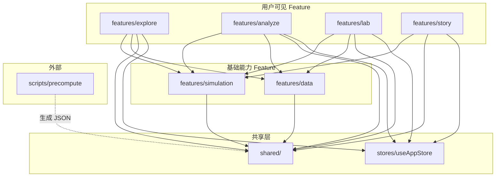

# 双摆混沌实验室 项目结构设计

## 版本记录

| 日期 | 版本 | 变更内容 | 关联技术栈 |
|------|------|----------|-----------|
| 2026-04-28 | v1.0 | 初始创建，Feature-Based 结构设计 | 双摆混沌实验室-技术栈设计.md v1.2 |

---

## 1. 项目基本信息

- **项目名称**：双摆混沌实验室（Chaos Pendulum Lab）
- **项目类型**：纯前端（自包含 HTML5 文件夹）
- **核心功能**：
  - 实时 3D 双摆物理仿真（Web Worker + 自实现 ODE 求解器）
  - 四模式递进：探索（3D + 声效）→ 分析（Lyapunov + 分岔 + 庞加莱）→ 实验（受力拆解 + 编程沙箱 + 报告）→ 故事（自动演示）
  - 离线 Python 预计算管线（Lyapunov 谱 + 分岔图数据生成）
  - 快照持久化、历史回放与分叉执行
- **目标平台**：Web 桌面优先，响应式兼容平板/手机
- **预期规模**：中型（4 个用户可见模式 + 2 个基础能力 Feature + 约 25 个功能模块）
- **团队规模**：1 人独立开发
- **代码组织风格**：Feature-Based（按业务功能聚合，高内聚低耦合）

---

## 2. 设计原则

1. **高内聚低耦合**：Feature 内部自治，Feature 间通过 `index.ts` 公共接口通信，禁止直接 import 内部文件
2. **单向依赖**：`shared/` ← 基础能力 Feature ← 用户可见 Feature。禁止反向依赖
3. **仿真核心下沉**：`simulation` Feature 作为平台能力被所有模式消费，不依赖任何用户可见 Feature
4. **共享层零业务逻辑**：`shared/` 仅含纯工具、通用 UI、类型定义，不含业务状态
5. **测试就近独立**：各 Feature 内 `__tests__/` 目录与源码分离但就近放置

---

## 3. 整体结构概览

```text
chaos-pendulum/
├── public/
│   └── pyodide/                         # Pyodide 离线 WASM 包（构建时原样拷贝至 dist/）
├── scripts/
│   └── precompute/                      # 离线预计算 Python 脚本（参数空间扫描）
├── src/
│   ├── main.tsx                         # 应用入口
│   ├── App.tsx                          # 根组件
│   ├── features/                        # 业务功能（Feature-Based）
│   │   ├── simulation/                  # [基础能力] 核心仿真引擎
│   │   ├── explore/                     # [可见模式] 探索模式
│   │   ├── analyze/                     # [可见模式] 分析模式
│   │   ├── lab/                         # [可见模式] 实验模式
│   │   ├── story/                       # [可见模式] 故事模式
│   │   └── data/                        # [基础能力] 数据与记录系统
│   ├── shared/                          # 跨 Feature 共享（零业务逻辑）
│   ├── stores/                          # 全局 Store（仅 useAppStore）
│   └── styles/                          # 全局样式
├── docs/                                # 项目文档
├── .github/workflows/                   # CI/CD
├── vite.config.ts
├── tailwind.config.ts
├── tsconfig.json
└── package.json
```

---

## 4. 详细目录说明

### 4.1 public/ — 静态资源

```text
public/
└── pyodide/                             # Pyodide 离线包
    ├── pyodide.js                        # Pyodide 主入口
    ├── pyodide.asm.wasm                  # WebAssembly 二进制
    ├── python_stdlib.zip                 # Python 标准库
    └── ...                               # 其他 Pyodide 资源文件
```

**设计重点**：
- Vite 构建时通过 `vite-plugin-static-copy` 原样拷贝至 `dist/` 输出目录
- 支持 file:// 协议直接读取，实现完全离线可用
- Pyodide 首次加载后写入 IndexedDB 持久化缓存，二次秒开

**关键约束**：禁止将运行时生成文件放入此目录。此目录仅放构建时静态资源。

---

### 4.2 scripts/precompute/ — Python 离线预计算

```text
scripts/
└── precompute/
    ├── __init__.py                       # 包声明
    ├── config.py                         # 参数网格配置（范围、分辨率、输出路径）
    ├── common.py                         # 共享工具：ODE 系统定义、solve_ivp 封装、进度条
    ├── lyapunov_spectrum.py              # Lyapunov 指数谱扫描脚本
    ├── bifurcation.py                    # 分岔图采样脚本
    ├── run_all.py                        # 一键运行全部预计算
    └── README.md                         # 运行说明与依赖
```

**各文件职责**：

| 文件 | 核心作用 | 输出 |
|------|---------|------|
| `config.py` | 集中管理所有扫描参数（网格范围、分辨率、输出目录），避免硬编码 | — |
| `common.py` | 双摆 ODE 系统定义、`solve_ivp` 封装、Benettin 算法 Lyapunov 估计、命令行进度条 | — |
| `lyapunov_spectrum.py` | 对 100×100 参数网格批量运行 Benettin 算法，输出最大 Lyapunov 指数矩阵 JSON | `src/shared/data/lyapunov-default.json` |
| `bifurcation.py` | 固定其他参数，沿单一控制参数扫描，记录稳态后 θ₂ 局部极大值集合 | `src/shared/data/bifurcation-default.json` |
| `run_all.py` | 串联执行上述两个脚本，统一入口 | — |

**关键约束**：
- Python 版本 ≥ 3.11，依赖 `numpy`, `scipy`
- 输出 JSON 直接写入 `src/shared/data/`，构建时随 Vite 打包至 `dist/assets/`
- 参数范围变更时需重新运行，输出文件附带参数哈希用于运行时缓存校验

**扩展预留**：新增预计算类型（如能量曲率扫描）时，新增一个脚本文件 + 在 `config.py` 中添加参数配置 + 在 `run_all.py` 中添加调用。

---

### 4.3 src/features/simulation/ — 核心仿真引擎

```text
src/features/simulation/
├── engine/                              # ODE 求解器
│   ├── rk4.ts                            # RK4 固定步长积分（60fps 实时仿真）
│   ├── rk45.ts                           # RK45 自适应步长积分（庞加莱截面穿越检测）
│   └── state-vector.ts                   # StateVector 类型、能量计算、工厂函数
├── worker/                              # Web Worker 通信层
│   ├── ode-worker.ts                     # Worker 入口：消息分发 → ODE 积分 → 结果回传
│   └── float64-pool.ts                   # Transferable Float64Array 池（10 块 × 4000 元素）
├── components/                          # 仿真 UI 组件
│   ├── ParameterPanel.tsx                # 参数控制面板（≥8 个参数的滑块 + 数值输入 + 合法性校验）
│   ├── EnergyMonitor.tsx                 # 能量实时监控（E_k + E_p 曲线 + 漂移百分比）
│   └── PhaseSpace.tsx                    # 2D 相空间可视化（θ-θ̇ 相平面 + 多变量切换）
├── store.ts                             # useSimulationStore：参数/状态向量/能量/Worker 消息总线
├── index.ts                             # 对外暴露：store + engine 类型 + Worker 接口
└── __tests__/
    ├── rk4.test.ts                       # RK4 精度测试
    ├── energy.test.ts                    # 能量守恒回归测试（1000s 漂移 < 0.5%）
    └── physics.test.ts                   # 物理验证三项（小角度 <2% / 单摆退化 / 能量守恒）
```

**设计重点**：
- `engine/` 是纯函数，不依赖 Worker/React，可独立在 Node 环境（Vitest）中测试
- `worker/` 封装 postMessage + Transferable 零拷贝，对外暴露简洁的 `step()` / `reset()` 接口
- `store.ts` 是其他 Feature 消费仿真数据的**唯一入口**
- 物理回归测试放在此 Feature 内，因为 ODE 引擎是其核心实现

**关键约束**：
- 禁止在 `engine/` 中引入任何 UI 依赖（React、DOM）
- 其他 Feature 只能通过 `index.ts` 导入，禁止直接 import `engine/rk4.ts` 等内部文件

---

### 4.4 src/features/explore/ — 探索模式

```text
src/features/explore/
├── components/
│   ├── Scene3D.tsx                       # R3F 3D 主场景（双摆模型 + 环境背景 + 光照）
│   ├── TrailRenderer.tsx                 # 速度-色彩映射尾迹（BufferGeometry + vertexColors）
│   ├── ViewControls.tsx                  # 视角系统（实验员/上帝/混沌三预设 + 自由旋转缩放）
│   ├── ButterflySplit.tsx                # 蝴蝶效应分屏对比（双 Viewport + 双 Worker + 同步控制）
│   ├── TimeReversal.tsx                  # 时间反演实验（精确反演 vs 数值反演 + 漂移曲线）
│   └── SonificationToggle.tsx            # 声音化开关按钮（用户手势激活 AudioContext）
├── hooks/
│   ├── useTrailBuffer.ts                 # 尾迹环形缓冲管理（追加/清空/持久度切换）
│   └── useSplitSync.ts                   # 蝴蝶效应双 Worker 同步控制与分离度计算
├── store.ts                             # exploreStore：视角预设/尾迹设置/分离状态/声效开关
├── index.ts
└── __tests__/
```

**关键约束**：
- 禁止直接访问 Worker（通过 `simulation` Feature 的 `index.ts` 接口）
- 3D 组件不包含业务逻辑，业务逻辑在 hooks 中

---

### 4.5 src/features/analyze/ — 分析模式

```text
src/features/analyze/
├── components/
│   ├── LyapunovHeatmap.tsx               # Lyapunov 热力图（D3 Canvas + d3-scale-chromatic 色阶）
│   ├── BifurcationChart.tsx              # 分岔图（D3 散点 + d3-zoom 框选放大 + 竖直游标联动）
│   ├── PoincarePlot.tsx                  # 庞加莱截面（动态生长散点 + 当前/历史轨线叠加）
│   └── EnergyLandscape.tsx               # 能量景观地形图（R3F 半透明曲面 + 实时光点 + 等高线投影）
├── hooks/
│   ├── useGridCache.ts                   # 预计算数据 IndexedDB 缓存（键 = 参数网格 hash）
│   └── useBidirectionalSync.ts           # 热力图/分岔图 ↔ 3D 仿真 双向联动
├── store.ts                             # analyzeStore：当前视图/图层选择/截面条件/缓存状态
├── index.ts
└── __tests__/
```

**关键约束**：
- 预计算数据通过 `shared/data/` 中的 JSON 文件 + IndexedDB 缓存加载
- 双向联动通过 `simulation` Feature 的 store 接口实现，不直接修改其状态

---

### 4.6 src/features/lab/ — 实验模式

```text
src/features/lab/
├── components/
│   ├── ForceDiagram.tsx                  # 受力拆解（力矢量叠加 + 坐标系切换 + 历史极值标记）
│   ├── ValidationSuite.tsx               # 物理验证套件 UI（三项一键验证 + 徽章展示）
│   ├── CodeSandbox.tsx                   # 用户可编程沙箱（CodeMirror 6 + Pyodide 执行 + 错误标注）
│   └── ReportGenerator.tsx               # 实验报告生成（jsPDF A4 + Canvas 截图 + autoTable）
├── hooks/
│   ├── usePyodide.ts                     # Pyodide 三级缓存加载 + 执行管理 + 中断控制
│   └── useCodeValidation.ts              # Python 异常解析 → 行号映射 → 中文错误词典
├── store.ts                             # labStore：沙箱代码/验证结果/报告配置/执行状态
├── templates/                           # 预设 Python 模板
│   ├── spring-pendulum.py                # 弹簧摆模板
│   ├── forced-pendulum.py                # 受迫摆模板
│   └── magnetic-pendulum.py              # 磁力摆模板
├── index.ts
└── __tests__/
```

**关键约束**：
- Pyodide 加载与执行逻辑集中在 `usePyodide` hook 中，组件不直接操作 Pyodide API
- 沙箱白名单 import 在此 Feature 内维护，不依赖外部配置

---

### 4.7 src/features/story/ — 故事模式

```text
src/features/story/
├── components/
│   ├── StoryEngine.tsx                   # 故事状态机（7 阶段编排 + requestAnimationFrame 时间轴）
│   ├── Subtitles.tsx                     # 电影式底部旁白字幕（淡入淡出动画）
│   ├── DemoMode.tsx                      # 演示模式（隐藏所有面板 + 0.5°/s 自动环绕）
│   └── HighlightGuide.tsx                # 交互控件脉冲高亮引导
├── store.ts                             # storyStore：阶段索引/字幕队列/打断标志/播放状态
├── script.ts                            # 故事脚本数据（7 阶段时间轴定义：时长/参数/相机/字幕）
├── index.ts
└── __tests__/
```

**关键约束**：
- 故事脚本数据（`script.ts`）与执行引擎（`StoryEngine.tsx`）分离，修改脚本无需改动引擎
- 打断机制通过 store 中的标志位实现，不直接操作其他 Feature 的状态

---

### 4.8 src/features/data/ — 数据与记录系统

```text
src/features/data/
├── components/
│   ├── SnapshotManager.tsx               # 快照管理面板（缩略卡片网格 + 恢复 + 双快照对比）
│   ├── ExportPanel.tsx                   # 数据导出面板（CSV/JSON/PNG 格式选择 + 分辨率配置）
│   └── HistoryTimeline.tsx               # 历史回放时间轴（Slider + 分叉执行入口）
├── snapshot/                            # 快照持久化
│   ├── snapshot-db.ts                    # IndexedDB 快照 store CRUD（键 snapshot-{uuid}）
│   └── thumbnail.ts                      # Canvas 64×64px 缩略图生成（toDataURL）
├── ring-buffer/                         # 轨迹环形缓冲
│   └── ring-buffer.ts                    # RingBuffer<StateVector>（6000 容量，O(1) 读写）
├── export/                              # 数据导出
│   ├── csv-export.ts                     # CSV 时序数据导出（角度/角速度/坐标/能量/时间戳）
│   ├── json-export.ts                    # JSON 场景文件导出（可分享复现）
│   └── png-export.ts                     # PNG 截图导出（3D/相空间/分岔图/庞加莱，最高 4K）
├── store.ts                             # dataStore：快照列表/导出状态/回放位置/分叉状态
├── index.ts
└── __tests__/
```

**关键约束**：
- `ring-buffer/` 是纯数据结构，不依赖 UI 或 IndexedDB
- 快照存储上限 50 个（≈ 2.5MB），超出时 LRU 淘汰

---

### 4.9 src/shared/ — 跨 Feature 共享层

```text
src/shared/
├── components/                          # 通用 UI 组件
│   ├── ui/                               # shadcn/ui 组件（Copy 模式：Slider/Tabs/Dialog/Tooltip/Button）
│   └── layout/                           # 全局布局壳
│       ├── AppShell.tsx                   # 响应式布局壳（桌面三栏 / 平板两栏 / 手机单栏）
│       ├── NavBar.tsx                     # 全局导航栏（探索/分析/实验/故事 四模式切换）
│       └── ModeSwitch.tsx                 # 模式切换器（tab 激活态 + 过渡动画）
├── hooks/                               # 通用 Hooks
│   ├── useContainerSize.ts               # ResizeObserver Canvas 尺寸自适应
│   ├── useDeviceType.ts                   # Tailwind 断点响应式判断（桌面/平板/手机）
│   └── useVisibilityChange.ts             # 页面可见性变化检测（后台自动暂停）
├── lib/                                 # 纯工具函数
│   ├── cache/
│   │   └── indexed-db.ts                  # 通用 IndexedDB 读写封装（打开/事务/游标）
│   └── observability/
│       ├── fps-tracker.ts                 # rAF 帧间差值滑动平均（最近 60 帧）
│       ├── perf-mark.ts                   # performance.mark/measure 封装
│       └── error-capture.ts              # window.onerror + unhandledrejection 全局捕获（环形 50 条）
├── audio/                               # Web Audio 声音化引擎
│   ├── audio-context.ts                   # AudioContext 惰性初始化管理
│   ├── sonification.ts                    # 四维参数→音频映射（音高/和声/音色/噪声）
│   └── noise-generator.ts                 # 白噪声 + 混响混沌听觉标记
├── types/                               # 全局 TypeScript 类型定义
│   ├── physics.ts                         # 物理类型：StateVector, PhysicsParams, EnergySnapshot
│   ├── simulation.ts                      # 仿真类型：WorkerMessage, FrameData, IntegratorType
│   └── app.ts                             # 应用类型：AppMode, DeviceType, SnapshotMeta
└── data/                                # 预计算 JSON 数据（构建时编译进 dist/assets/）
    ├── lyapunov-default.json              # 默认 Lyapunov 100×100 网格矩阵（浮点值）
    └── bifurcation-default.json           # 默认分岔采样序列（参数→θ₂ 极大值集合）
```

**关键约束**：
- **禁止依赖 `features/` 中的任何模块**。共享层是最底层，依赖方向只能向下
- `shared/data/` 中的 JSON 由 `scripts/precompute/` 生成，手动触发，不自动生成

---

### 4.10 src/stores/ — 全局 Store

```text
src/stores/
└── useAppStore.ts                       # 唯一全局 Store
```

`useAppStore` 仅管理跨所有 Feature 共享的最小状态：

| 字段 | 类型 | 说明 |
|------|------|------|
| `currentMode` | `AppMode` | 当前激活模式（explore / analyze / lab / story） |
| `deviceType` | `DeviceType` | 当前设备类型（desktop / tablet / mobile） |
| `loadingState` | `LoadingState` | 应用初始化加载状态（loading / ready / error） |
| `debugInfo` | `DebugInfo` | 可观测性数据（FPS / Worker 耗时 / 错误日志环形缓冲） |

**关键约束**：
- 全局 Store **不放**业务逻辑状态，业务状态归各 Feature 的 store 管理
- 全局 Store 不直接引用任何 Feature 的类型

---

## 5. 特殊文件说明

| 文件 | 作用 | 注意事项 |
|------|------|---------|
| `vite.config.ts` | Vite 构建配置：resolve alias `@/`→`src/`、vite-plugin-static-copy 复制 pyodide、Worker 模块配置 | `build.outDir` 为 `dist/`，产物为自包含 HTML5 文件夹 |
| `tailwind.config.ts` | Tailwind CSS 配置：content 路径指向 `src/` 下所有 tsx 文件 | 构建时 Purge 未使用样式至 ~3KB |
| `tsconfig.json` | TypeScript 编译配置：strict 模式、路径别名 `@/` → `src/` | 启用 `noUncheckedIndexedAccess` 防止数组越界 |
| `.github/workflows/ci.yml` | CI/CD 三阶段流水线：代码检查 → 测试 + 物理回归 → 构建 | 仅在 push/PR 时触发 |
| `package.json` | 依赖管理与脚本定义 | `scripts` 包含 `dev`/`build`/`test`/`precompute` 命令 |

---

## 6. 模块间依赖关系



**核心规则**：
1. 箭头方向 = 依赖方向，禁止反向
2. 用户可见 Feature 之间无直接依赖（互相独立）
3. `shared/` 是最底层，不依赖任何上层
4. 虚线 = 构建时数据流，非运行时依赖

---

## 7. 扩展性考虑

### 7.1 新增用户可见模式（如"教学模式"）

```text
src/features/teaching/                    # 新增 Feature
├── components/
├── hooks/
├── store.ts
├── index.ts
└── __tests__/
```

操作步骤：
1. 在 `features/` 下新建目录
2. 在 `shared/types/app.ts` 的 `AppMode` 联合类型中新增值
3. 在 `shared/components/layout/NavBar.tsx` 中添加导航项
4. 如需使用仿真能力，从 `features/simulation` 的 `index.ts` 导入

### 7.2 新增预计算数据类型

```text
scripts/precompute/energy_curvature.py    # 新增脚本
src/shared/data/energy-curvature-default.json  # 新增输出
```

操作步骤：
1. 在 `scripts/precompute/` 新增脚本，遵循 `config.py` 配置
2. 在 `scripts/precompute/run_all.py` 添加调用
3. 在消费 Feature（如 `analyze`）中添加加载逻辑

### 7.3 未来技术迁移预留

- **状态管理替换**：各 Feature 的 store 通过 `index.ts` 导出，外部不感知 Zustand，替换库只需修改 store 文件内部实现
- **3D 渲染库替换**：3D 相关组件封装在 `explore/components/` 内，其他 Feature 不直接依赖 R3F
- **构建工具替换**：Vite 配置集中在根目录，无深度耦合

---

## 8. 测试与文档规划

### 8.1 测试分层

| 测试类型 | 位置 | 工具 | 覆盖范围 |
|---------|------|------|---------|
| 单元测试（引擎） | `features/simulation/__tests__/` | Vitest | ODE 求解器精度、RingBuffer 数据结构、Float64Pool |
| 物理回归测试 | `features/simulation/__tests__/` | Vitest | 小角度 <2%、单摆退化周期吻合、1000s 能量漂移 <0.5% |
| 单元测试（工具） | `shared/` 相邻 `__tests__/`（按需） | Vitest | IndexedDB 封装、FPS 追踪、音频映射函数 |
| 组件测试 | 各 Feature `__tests__/` | Vitest + @testing-library/react | 参数面板校验、快照卡片渲染、故事状态机 |
| 构建验证 | CI 流水线 | GitHub Actions | tsc --noEmit + vite build 成功 + 产物完整性 |

### 8.2 文档结构

```text
docs/
├── 功能设计/
│   ├── 功能设计_v0.md                     # 功能设计主文档
│   └── 功能模块全拆解.md                   # 功能模块枚举（含编号与溯源）
├── 双摆混沌实验室-技术栈设计.md             # 技术选型与架构设计
└── 双摆混沌实验室-项目结构.md               # [本文档] 项目目录结构与模块边界
```

---

## 9. 最佳实践说明

1. **Feature-Based 组织**：每个 Feature 是自包含的功能单元，包含自己的组件、hooks、store、类型、测试。新增功能只需在一个目录内操作，删除功能只需删除一个目录
2. **index.ts 公共接口**：每个 Feature 通过 `index.ts` 对外暴露有限接口，内部实现修改不影响外部消费者
3. **仿真引擎下沉**：`simulation` Feature 作为底层平台能力，封装 Worker 通信和 ODE 求解，上层模式通过统一接口消费，避免跨模式耦合
4. **全局 Store 最小化**：仅 `useAppStore` 管理跨模式全局状态，业务状态下沉至各 Feature 内部 Store，避免全局 Store 膨胀
5. **共享层零业务**：`shared/` 仅含纯函数工具、通用 UI 壳、类型定义，不包含任何业务逻辑或状态
6. **预计算管线分离**：Python 脚本独立于前端构建流程，手动触发，输出 JSON 作为静态资源引入。数据生成与数据消费完全解耦

---

*本文档由 AI 辅助生成，建议经技术负责人评审后生效。*
