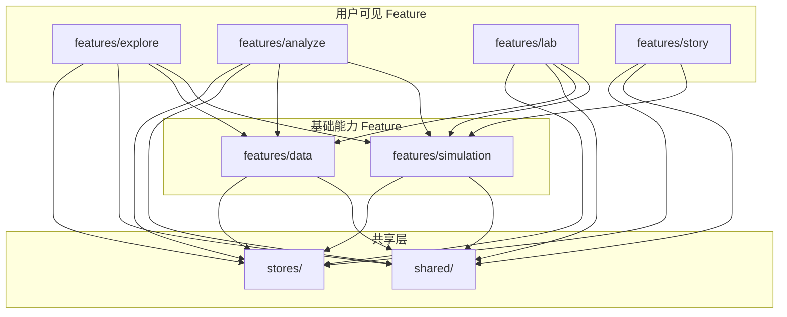

# 双摆混沌实验室 项目结构设计

## 版本记录

| 日期 | 版本 | 变更内容 |
|------|------|----------|
| 2026-04-28 | v1.0 | 初始创建，Feature-Based 结构设计 |
| 2026-06-13 | v2.0 | 全面重构：Clean Architecture 五层模型落地，删除 system feature，清理所有死代码 |

---

## 1. 架构模型

采用 **Clean Architecture 五层模型**，依赖方向向内：

```
View          ← 渲染、事件转发、GUI 专属状态（isHovered, scrollY）
  │  依赖方向向内
  ▼
ViewModel     ← 跨介质 UI 状态（isLoading, error, selectedTab）、Zustand Store
  │
  ▼
Application   ← 无状态用例编排、端口接口定义、DTO
  │
  ▼
Domain        ← 实体、值对象、纯业务规则、纯函数
  ↑
  │  实现端口
  │
Infrastructure ← API/Worker/IndexedDB/Web Audio 实现
```

### 铁律

| 层 | 可以依赖 | 禁止依赖 |
|----|---------|---------|
| Domain | 无（shared/domain 类型除外） | React、Zustand、Worker API |
| Application | Domain | React、Zustand、axios |
| ViewModel | Application、Domain | Infrastructure 实现 |
| View | ViewModel | Application、Domain、Infrastructure |
| Infrastructure | Application（实现端口） | ViewModel、View |

---

## 2. 整体结构概览

```
chaos-pendulum/
├── public/pyodide/                       # Pyodide 离线 WASM 包
├── scripts/precompute/                   # Python 离线预计算脚本
├── src/
│   ├── main.tsx                          # 应用入口
│   ├── App.tsx                           # 根组件
│   ├── shared/                           # 跨 Feature 共享层（零业务逻辑）
│   │   ├── domain/valueObjects/          # 共享值对象（物理类型、仿真类型、应用类型）
│   │   ├── viewModel/hooks/              # 共享 Hook（useContainerSize, useDeviceType 等）
│   │   ├── view/components/              # 共享 UI（shadcn/ui, AppShell, NavBar, ToastProvider）
│   │   └── infrastructure/               # 共享基础设施
│   │       ├── error-handling/           # 错误码字典、Toast 通知、全局错误处理
│   │       ├── storage/                  # IndexedDB 封装、预计算数据加载器
│   │       ├── observability/            # FPS 追踪、performance.mark、错误捕获
│   │       ├── audio/                    # Web Audio 声音化引擎
│   │       └── commandBus.ts             # 事件总线（解耦 Worker ↔ Store）
│   ├── features/                         # 业务功能（Feature-Based + 五层架构）
│   │   ├── simulation/                   # [基础能力] 核心仿真引擎
│   │   ├── explore/                      # [可见模式] 探索模式
│   │   ├── analyze/                      # [可见模式] 分析模式
│   │   ├── lab/                          # [可见模式] 实验模式
│   │   ├── story/                        # [可见模式] 故事模式
│   │   └── data/                         # [基础能力] 数据与记录系统
│   ├── stores/                           # 全局 Store
│   │   ├── useAppStore.ts                # 全局状态（currentMode, deviceType, loadingState）
│   │   └── rootStore.ts                  # 聚合各 feature 的 viewModel/stores/ slice
│   └── styles/                           # 全局样式
├── docs/                                 # 项目文档
└── 配置文件（vite.config.ts, tailwind.config.ts, tsconfig.json, package.json）
```

---

## 3. 各 Feature 五层结构

### 3.1 simulation — 核心仿真引擎

```
simulation/
├── domain/
│   └── services/                 ← ODE 右端函数、RK4/RK45 积分器、状态向量计算（纯数学，零框架依赖）
├── application/
│   ├── useCases/                 ← 启动编排、仿真控制（无状态用例）
│   ├── ports/                    ← IWorkerGateway 等接口定义
│   └── dto/                      ← 数据传输对象
├── viewModel/
│   ├── stores/                   ← simulationSlice（Zustand slice）
│   └── hooks/                    ← useSimulationControls, useEnergyMonitor, useAutoPause 等
├── view/
│   └── components/               ← ParamPanel, ParamSlider, EnergyCanvas, BootManager 等
├── infrastructure/
│   ├── worker/                   ← ode-worker, Float64Pool, Scheduler, Bridge
│   └── repositories/            ← SimulationHistoryRepo
└── index.ts                      ← 公共 barrel
```

### 3.2 explore — 探索模式

```
explore/
├── domain/                       ← 蝴蝶效应计算、力矢量分解、视角预设（待进一步拆分）
├── viewModel/
│   ├── stores/                   ← exploreSlice, butterflySlice
│   └── hooks/                    ← useButterflyMode, useSceneController, useTrailBuffer 等
├── components/                   ← Scene3D, TrailRenderer, ButterflySplit, TimeReversal 等
└── hooks/                        ← useSonification, useChaosUpdater 等
```

### 3.3 analyze — 分析模式

```
analyze/
├── domain/
│   └── types.ts                  ← LyapunovGrid, BifurcationData, classifyLambda, classifyRegime
├── application/                  ← 预计算数据加载用例（待填充）
├── viewModel/
│   └── stores/                   ← analyzeSlice
├── view/
│   └── ui/                       ← LyapunovHeatmap, BifurcationPlot, PoincareSection
├── infrastructure/               ← PrecomputeDataRepo（包装 shared precomputeLoader）
└── hooks/                        ← useAnalysisView, usePrecomputeData
```

### 3.4 lab — 实验模式

```
lab/
├── domain/
│   └── services/                 ← 物理验证计算（validationCalculator）
├── application/                  ← 用例编排（待填充）
├── viewModel/
│   └── stores/                   ← labSlice
├── view/
│   └── components/               ← DecompositionPanel, ForceArrows3D
├── infrastructure/               ← Pyodide 缓存管理器
├── templates/                    ← Python 预设模板
└── hooks/                        ← useLabValidation
```

### 3.5 story — 故事模式

```
story/
├── domain/
│   └── valueObjects/             ← 故事脚本数据类型
├── application/                  ← 阶段推进用例（待填充）
├── viewModel/
│   └── stores/                   ← storySlice
└── view/                         ← StoryPage
```

### 3.6 data — 数据与记录系统

```
data/
├── domain/
│   └── valueObjects/             ← RingBuffer（纯数据结构）
├── application/                  ← 快照保存/导出用例（待填充）
├── viewModel/
│   └── stores/                   ← dataSlice
├── view/                         ← 快照管理器、导出面板（待实现）
└── infrastructure/
    ├── repositories/             ← IndexedDB 快照 CRUD
    ├── storage/                  ← 缩略图生成器
    └── export/                   ← CSV/JSON/PNG 导出器
```

---

## 4. 共享层（shared/）

```
shared/
├── domain/
│   └── valueObjects/
│       ├── physics.ts            ← PendulumParams, InitialConditions, StateVector, 预设, 参数元数据
│       ├── simulation.ts         ← FrameField, WorkerCommand/Response, PoincareSection 等
│       └── app.ts               ← AppMode, DeviceType, ModeRegistry, DeviceInfo
├── viewModel/
│   └── hooks/
│       ├── useContainerSize.ts   ← ResizeObserver Canvas 尺寸自适应
│       ├── useDeviceType.ts      ← 响应式断点检测 + 降级规则
│       ├── useKeyboardShortcuts.ts ← 1234 快捷键模式切换
│       ├── useToast.ts           ← Toast 通知 Hook
│       └── useVisibilityChange.ts ← 页面可见性检测
├── view/
│   └── components/
│       ├── ui/                   ← shadcn/ui 组件（button, slider, tabs, dialog 等，Copy 模式）
│       ├── layout/               ← AppShell, GlobalNavBar, ModeErrorBoundary
│       ├── debug/                ← DebugPanel
│       ├── DeviceProvider.tsx    ← 设备类型检测 Provider
│       └── ToastProvider.tsx     ← Sonner Toaster 挂载
├── infrastructure/
│   ├── error-handling/
│   │   ├── types.ts              ← ErrorCode, ToastInput 等类型
│   │   ├── constants.ts          ← 错误处理配置常量
│   │   ├── error-dictionary.ts   ← 错误码 → 中文消息映射
│   │   ├── notify.ts             ← Toast 通知触发函数
│   │   ├── handleGlobalErrors.ts ← 全局错误捕获回调
│   │   └── index.ts              ← barrel
│   ├── storage/
│   │   ├── indexed-db.ts         ← 通用 IndexedDB 读写封装
│   │   ├── precomputeLoader.ts   ← 预计算数据加载器（fetch + IndexedDB 缓存 + 校验）
│   │   └── precomputePrefetch.ts ← 预计算数据预取
│   ├── observability/
│   │   ├── fps-tracker.ts        ← rAF 帧间差值滑动平均
│   │   ├── perf-mark.ts          ← performance.mark/measure 封装
│   │   ├── error-capture.ts      ← window.onerror + unhandledrejection 全局捕获
│   │   ├── coordinator.ts        ← 可观测性协调器
│   │   └── types.ts              ← 可观测性类型
│   ├── audio/
│   │   ├── audio-context.ts      ← AudioContext 惰性初始化
│   │   ├── sonification.ts       ← 四维参数 → 音频映射
│   │   └── noise-generator.ts    ← 白噪声 + 混响
│   └── commandBus.ts             ← 轻量级事件总线（Worker ↔ Store 解耦）
├── constants/                    ← 断点常量等
└── data/                         ← 预计算 JSON 数据 + 混沌名言
```

### 关键约束
- **禁止依赖 `features/` 中的任何模块**
- `shared/domain/valueObjects/` 仅含类型定义，不含业务规则函数
- 基础设施代码不感知 UI——不 import React 组件或 Hook

---

## 5. 全局 Store

```
stores/
├── useAppStore.ts                ← 唯一全局 Store（currentMode, deviceType, loadingState, debugInfo）
└── rootStore.ts                  ← 聚合各 feature viewModel/stores/ 的 Zustand slice
```

### Slice 归属

| Slice | 位置 |
|-------|------|
| simulationSlice | `simulation/viewModel/stores/simulationSlice.ts` |
| historySlice | `simulation/viewModel/stores/historySlice.ts` |
| exploreSlice | `explore/viewModel/stores/exploreSlice.ts` |
| butterflySlice | `explore/viewModel/stores/butterflySlice.ts` |
| analyzeSlice | `analyze/viewModel/stores/analyzeSlice.ts` |
| labSlice | `lab/viewModel/stores/labSlice.ts` |
| dataSlice | `data/viewModel/stores/dataSlice.ts` |
| storySlice | `story/viewModel/stores/storySlice.ts` |

每个 feature 通过自己的 `store.ts` 封装对 rootStore 的访问（如 `useSimulationStore()`），外部仅通过 feature barrel 导入。

---

## 6. 模块间依赖关系



**核心规则**：
1. 箭头方向 = 依赖方向，禁止反向
2. `shared/` 是最底层，不依赖任何 feature
3. 用户可见 Feature 之间无直接依赖
4. 每个 Feature 内部遵循 Domain → Application → ViewModel → View 依赖向内

---

## 7. v2.0 重构变更摘要

### 删除
- `src/features/system/` — 拆解至 shared（错误处理）+ simulation（启动序列）+ lab（Pyodide）
- `src/components/` — DeviceProvider 迁至 shared/view/components/
- `src/shared/components/` `hooks/` `lib/` `audio/` `types/` — 迁至 shared 内五层子目录
- `src/stores/slices/` — 迁至各 feature 的 viewModel/stores/
- 全量旧 barrel re-export 文件

### 新增
- 全部 6 个 feature 的五层目录骨架 + 35+ README.md
- `shared/domain/valueObjects/index.ts` barrel
- `shared/infrastructure/error-handling/index.ts` barrel
- `shared/infrastructure/error-handling/handleGlobalErrors.ts`
- `shared/infrastructure/commandBus.ts`

### 不变
- `public/pyodide/` — 离线 Pyodide 包
- `scripts/precompute/` — Python 预计算脚本
- `docs/` — 项目文档
- 根目录配置文件

---

*本文档由 Claude Code 辅助生成，v2.0 根据实际重构结果更新。*
